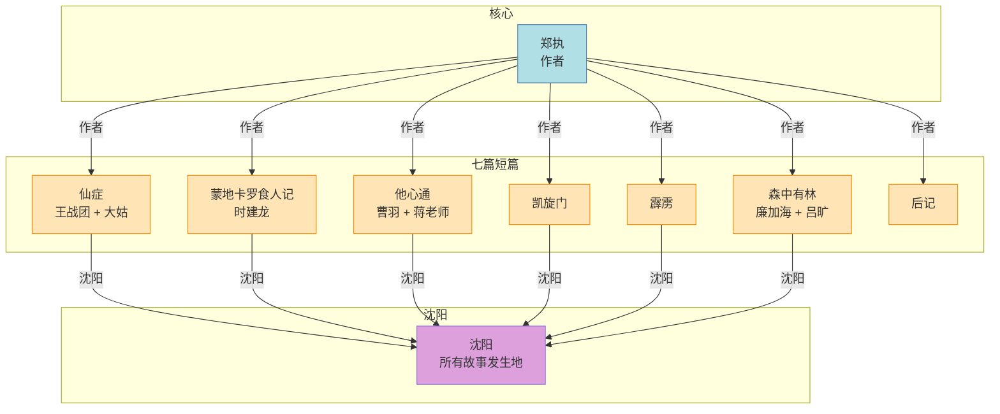

```mermaid
%% 仙症 - 故事关系图
graph TB
    subgraph CORE[核心]
        ZHENG[郑执<br/>作者]
    end
    subgraph STORY[七篇短篇]
        S1[仙症<br/>王战团 + 大姑]
        S2[蒙地卡罗食人记<br/>时建龙]
        S3[他心通<br/>曹羽 + 蒋老师]
        S4[凯旋门]
        S5[霹雳]
        S6[森中有林<br/>廉加海 + 吕旷]
        POST[后记]
    end
    subgraph PLACE[沈阳]
        SHENYANG[沈阳<br/>所有故事发生地]
    end
    ZHENG -->|作者| S1
    ZHENG -->|作者| S2
    ZHENG -->|作者| S3
    ZHENG -->|作者| S4
    ZHENG -->|作者| S5
    ZHENG -->|作者| S6
    ZHENG -->|作者| POST
    S1 -->|沈阳| SHENYANG
    S2 -->|沈阳| SHENYANG
    S3 -->|沈阳| SHENYANG
    S4 -->|沈阳| SHENYANG
    S5 -->|沈阳| SHENYANG
    S6 -->|沈阳| SHENYANG
    classDef core fill:#B0E0E6,stroke:#4682B4
    classDef story fill:#FFE4B5,stroke:#FF8C00
    classDef place fill:#DDA0DD,stroke:#9370DB
    class ZHENG core
    class S1,S2,S3,S4,S5,S6,POST story
    class SHENYANG place
```
