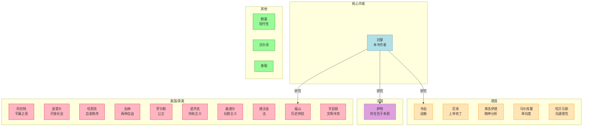

```mermaid
%% 西方现代思想 - 思想家关系图
graph TB
    subgraph CORE[核心作者]
        LIU[刘擎<br/>本书作者]
    end
    subgraph GER[德国]
        WEBER[韦伯<br/>祛魅]
        NIETZSCHE[尼采<br/>上帝死了]
        FREUD[弗洛伊德<br/>精神分析]
        MARCUSE[马尔库塞<br/>单向度]
        HABERMAS[哈贝马斯<br/>沟通理性]
    end
    subgraph FRA[法国]
        SARTRE[萨特<br/>存在先于本质]
    end
    subgraph US[美国/英美]
        ARENDT[阿伦特<br/>平庸之恶]
        POPPER[波普尔<br/>开放社会]
        HAYEK[哈耶克<br/>自发秩序]
        BERLIN[伯林<br/>两种自由]
        RAWLS[罗尔斯<br/>公正]
        NOZICK[诺齐克<br/>持有正义]
        SANDEL[桑德尔<br/>社群主义]
        DWORKIN[德沃金<br/>法]
        FUKUYAMA[福山<br/>历史终结]
        HUNTINGTON[亨廷顿<br/>文明冲突]
    end
    subgraph OTH[其他]
        BAUMAN[鲍曼<br/>现代性]
        WALZER[沃尔泽]
        TAYLOR[泰勒]
    end
    LIU -->|研究| WEBER
    LIU -->|研究| SARTRE
    LIU -->|研究| FUKUYAMA
    classDef core fill:#B0E0E6,stroke:#4682B4
    classDef ger fill:#FFE4B5,stroke:#FF8C00
    classDef fra fill:#DDA0DD,stroke:#9370DB
    classDef us fill:#FFB6C1,stroke:#DC143C
    classDef oth fill:#98FB98,stroke:#228B22
    class LIU core
    class WEBER,NIETZSCHE,FREUD,MARCUSE,HABERMAS ger
    class SARTRE fra
    class ARENDT,POPPER,HAYEK,BERLIN,RAWLS,NOZICK,SANDEL,DWORKIN,FUKUYAMA,HUNTINGTON us
    class BAUMAN,WALZER,TAYLOR oth
```
