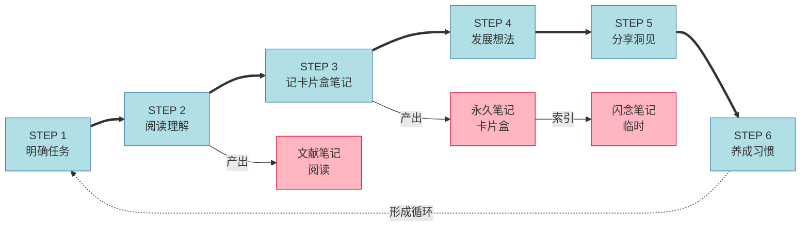

```mermaid
%% 卡片笔记写作法 - 6 STEPs + 三种笔记
graph LR
    STEP1[STEP 1<br/>明确任务]:::step
    STEP2[STEP 2<br/>阅读理解]:::step
    STEP3[STEP 3<br/>记卡片盒笔记]:::step
    STEP4[STEP 4<br/>发展想法]:::step
    STEP5[STEP 5<br/>分享洞见]:::step
    STEP6[STEP 6<br/>养成习惯]:::step
    FLEETING[闪念笔记<br/>临时]:::note
    PERMANENT[永久笔记<br/>卡片盒]:::note
    LITERATURE[文献笔记<br/>阅读]:::note
    STEP1 ==> STEP2
    STEP2 ==> STEP3
    STEP3 ==> STEP4
    STEP4 ==> STEP5
    STEP5 ==> STEP6
    STEP6 -.->|形成循环| STEP1
    STEP2 -->|产出| LITERATURE
    STEP3 -->|产出| PERMANENT
    PERMANENT -->|索引| FLEETING
    classDef step fill:#B0E0E6,stroke:#4682B4
    classDef note fill:#FFB6C1,stroke:#DC143C
```
