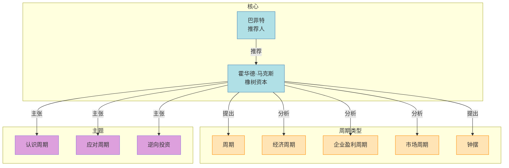

```mermaid
%% 周期 - 核心概念关系图
graph TB
    subgraph CORE[核心]
        HOWARD[霍华德·马克斯<br/>橡树资本]
        BUFFETT[巴菲特<br/>推荐人]
    end
    subgraph CYCLES[周期类型]
        CYCLE[周期]
        ECON[经济周期]
        CORP[企业盈利周期]
        MARKET[市场周期]
        PENDULUM[钟摆]
    end
    subgraph THEMES[主题]
        T1[认识周期]
        T2[应对周期]
        T3[逆向投资]
    end
    HOWARD -->|提出| CYCLE
    HOWARD -->|分析| ECON
    HOWARD -->|分析| CORP
    HOWARD -->|分析| MARKET
    HOWARD -->|提出| PENDULUM
    BUFFETT -->|推荐| HOWARD
    HOWARD -->|主张| T1
    HOWARD -->|主张| T2
    HOWARD -->|主张| T3
    classDef core fill:#B0E0E6,stroke:#4682B4
    classDef cycles fill:#FFE4B5,stroke:#FF8C00
    classDef themes fill:#DDA0DD,stroke:#9370DB
    class HOWARD,BUFFETT core
    class CYCLE,ECON,CORP,MARKET,PENDULUM cycles
    class T1,T2,T3 themes
```
