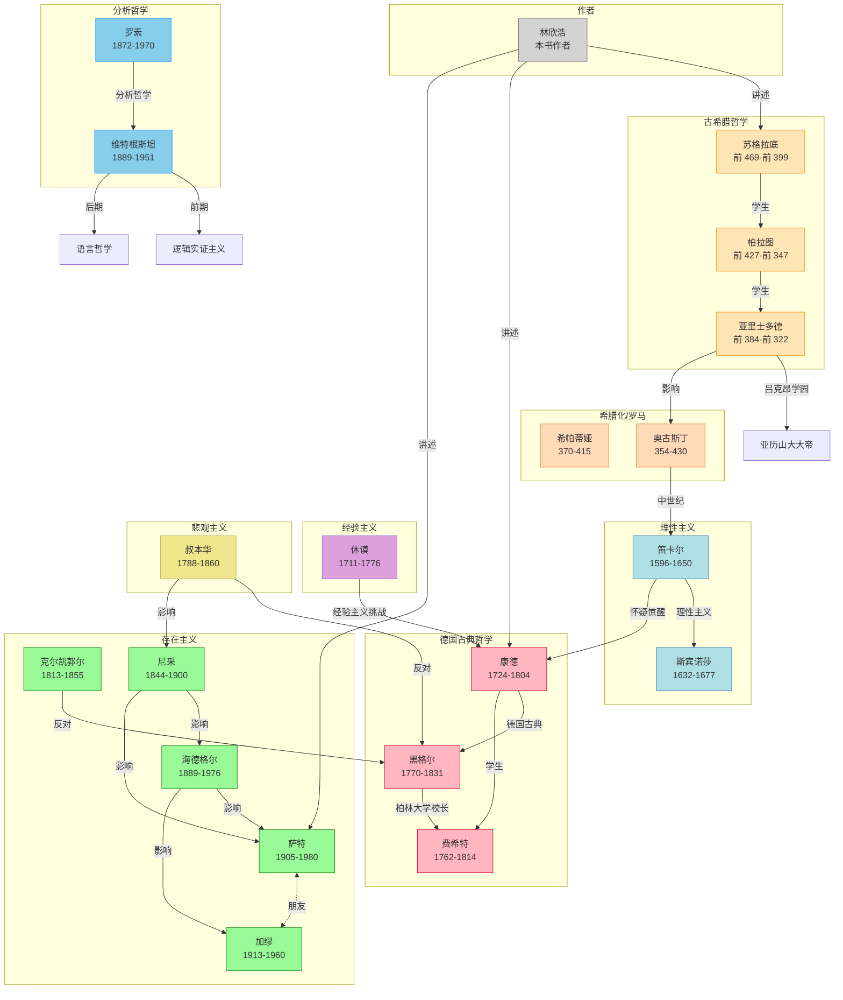

```mermaid
%% 哲学家们都干了些什么 - 思想史时间线
graph TB
    subgraph GREEK[古希腊哲学]
        SOCRATES[苏格拉底<br/>前 469-前 399]
        PLATO[柏拉图<br/>前 427-前 347]
        ARISTOTLE[亚里士多德<br/>前 384-前 322]
    end
    subgraph HELLENISTIC[希腊化/罗马]
        HYPATIA[希帕蒂娅<br/>370-415]
        AUGUSTINE[奥古斯丁<br/>354-430]
    end
    subgraph RATIONAL[理性主义]
        DESCARTES[笛卡尔<br/>1596-1650]
        SPINOZA[斯宾诺莎<br/>1632-1677]
    end
    subgraph EMPIRICISM[经验主义]
        HUME[休谟<br/>1711-1776]
    end
    subgraph KANTIAN[德国古典哲学]
        KANT[康德<br/>1724-1804]
        HEGEL[黑格尔<br/>1770-1831]
        FICHTE[费希特<br/>1762-1814]
    end
    subgraph PESSIMISM[悲观主义]
        SCHOPENHAUER[叔本华<br/>1788-1860]
    end
    subgraph EXIST[存在主义]
        KIERKEGAARD[克尔凯郭尔<br/>1813-1855]
        NIETZSCHE[尼采<br/>1844-1900]
        HEIDEGGER[海德格尔<br/>1889-1976]
        SARTRE[萨特<br/>1905-1980]
        CAMUS[加缪<br/>1913-1960]
    end
    subgraph ANALYTIC[分析哲学]
        RUSSELL[罗素<br/>1872-1970]
        WITTGENSTEIN[维特根斯坦<br/>1889-1951]
    end
    subgraph AUTHOR[作者]
        LIN[林欣浩<br/>本书作者]
    end
    SOCRATES -->|学生| PLATO
    PLATO -->|学生| ARISTOTLE
    ARISTOTLE -->|吕克昂学园| ALEXANDER[亚历山大大帝]
    ARISTOTLE -->|影响| AUGUSTINE
    AUGUSTINE -->|中世纪| DESCARTES
    DESCARTES -->|理性主义| SPINOZA
    DESCARTES -->|怀疑惊醒| KANT
    HUME -->|经验主义挑战| KANT
    KANT -->|德国古典| HEGEL
    KANT -->|学生| FICHTE
    HEGEL -->|柏林大学校长| FICHTE
    SCHOPENHAUER -->|反对| HEGEL
    SCHOPENHAUER -->|影响| NIETZSCHE
    KIERKEGAARD -->|反对| HEGEL
    NIETZSCHE -->|影响| HEIDEGGER
    NIETZSCHE -->|影响| SARTRE
    HEIDEGGER -->|影响| SARTRE
    HEIDEGGER -->|影响| CAMUS
    SARTRE <-.->|朋友| CAMUS
    RUSSELL -->|分析哲学| WITTGENSTEIN
    WITTGENSTEIN -->|前期| LOGICAL[逻辑实证主义]
    WITTGENSTEIN -->|后期| LANGUAGE[语言哲学]
    LIN -->|讲述| SOCRATES
    LIN -->|讲述| KANT
    LIN -->|讲述| SARTRE
    classDef greek fill:#FFE4B5,stroke:#FF8C00
    classDef hellenistic fill:#FFDAB9,stroke:#CD853F
    classDef rational fill:#B0E0E6,stroke:#4682B4
    classDef empir fill:#DDA0DD,stroke:#9370DB
    classDef kantian fill:#FFB6C1,stroke:#DC143C
    classDef pessimism fill:#F0E68C,stroke:#BDB76B
    classDef exist fill:#98FB98,stroke:#228B22
    classDef analytic fill:#87CEEB,stroke:#1E90FF
    classDef author fill:#D3D3D3,stroke:#808080
    class SOCRATES,PLATO,ARISTOTLE greek
    class HYPATIA,AUGUSTINE hellenistic
    class DESCARTES,SPINOZA rational
    class HUME empir
    class KANT,HEGEL,FICHTE kantian
    class SCHOPENHAUER pessimism
    class KIERKEGAARD,NIETZSCHE,HEIDEGGER,SARTRE,CAMUS exist
    class RUSSELL,WITTGENSTEIN analytic
    class LIN author
```
