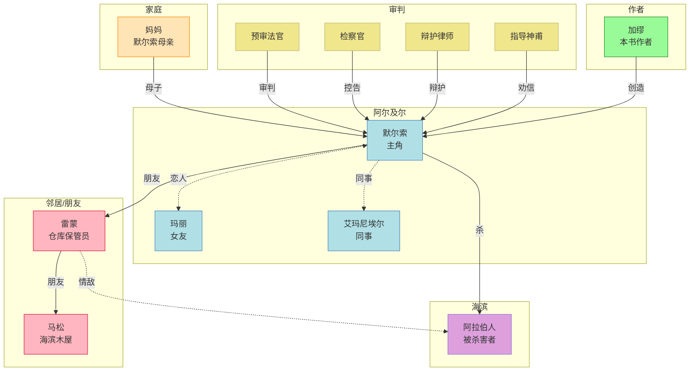

```mermaid
%% 局外人 - 人物关系图
graph TB
    subgraph FAMILY[家庭]
        MAMAN[妈妈<br/>默尔索母亲]
    end
    subgraph ALGIERS[阿尔及尔]
        MEURSAULT[默尔索<br/>主角]
        MARIE[玛丽<br/>女友]
        EMMANUEL[艾玛尼埃尔<br/>同事]
    end
    subgraph NEIGHBOR[邻居/朋友]
        RAYMOND[雷蒙<br/>仓库保管员]
        MASSON[马松<br/>海滨木屋]
    end
    subgraph BEACH[海滨]
        ARAB[阿拉伯人<br/>被杀害者]
    end
    subgraph TRIAL[审判]
        JUDGE[预审法官]
        PROSECUTOR[检察官]
        DEFENSE[辩护律师]
        PRIEST[指导神甫]
    end
    subgraph AUTHOR[作者]
        CAMUS[加缪<br/>本书作者]
    end
    MAMAN -->|母子| MEURSAULT
    MEURSAULT <-.->|恋人| MARIE
    MEURSAULT -.->|同事| EMMANUEL
    MEURSAULT -->|朋友| RAYMOND
    RAYMOND -->|朋友| MASSON
    MEURSAULT -->|杀| ARAB
    RAYMOND -.->|情敌| ARAB
    JUDGE -->|审判| MEURSAULT
    PROSECUTOR -->|控告| MEURSAULT
    DEFENSE -->|辩护| MEURSAULT
    PRIEST -->|劝信| MEURSAULT
    CAMUS -->|创造| MEURSAULT
    classDef family fill:#FFE4B5,stroke:#FF8C00
    classDef algiers fill:#B0E0E6,stroke:#4682B4
    classDef neighbor fill:#FFB6C1,stroke:#DC143C
    classDef beach fill:#DDA0DD,stroke:#9370DB
    classDef trial fill:#F0E68C,stroke:#BDB76B
    classDef author fill:#98FB98,stroke:#228B22
    class MAMAN family
    class MEURSAULT,MARIE,EMMANUEL algiers
    class RAYMOND,MASSON neighbor
    class ARAB beach
    class JUDGE,PROSECUTOR,DEFENSE,PRIEST trial
    class CAMUS author
```
