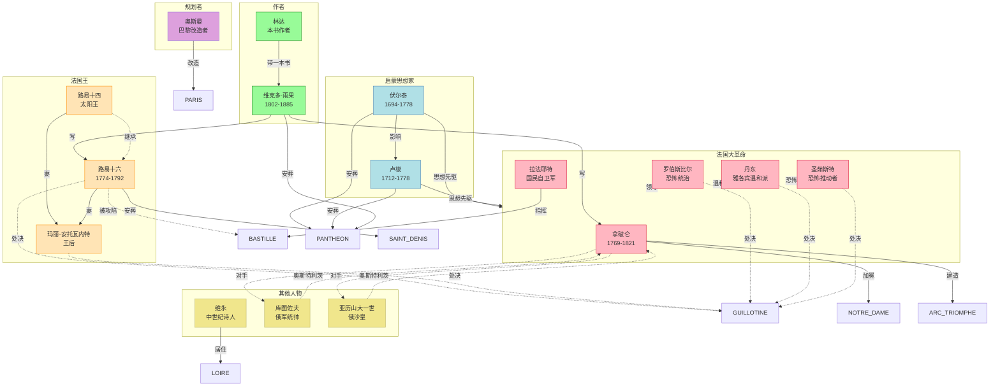

```mermaid
%% 带一本书去巴黎 - 人物关系图
graph TB
    subgraph AUTHORS[作者]
        LINDA[林达<br/>本书作者]
        HUGO[维克多·雨果<br/>1802-1885]
    end
    subgraph ROYAL[法国王]
        LOUIS14[路易十四<br/>太阳王]
        LOUIS16[路易十六<br/>1774-1792]
        MARIE[玛丽·安托瓦内特<br/>王后]
    end
    subgraph REVOLUTION[法国大革命]
        NAPOLEON[拿破仑<br/>1769-1821]
        ROBESPIERRE[罗伯斯比尔<br/>恐怖统治]
        LAFAYETTE[拉法耶特<br/>国民自卫军]
        DANTON[丹东<br/>雅各宾温和派]
        SAINTJUST[圣茹斯特<br/>恐怖推动者]
    end
    subgraph ENLIGHTENMENT[启蒙思想家]
        VOLTAIRE[伏尔泰<br/>1694-1778]
        ROUSSEAU[卢梭<br/>1712-1778]
    end
    subgraph PLANNERS[规划者]
        HAUSSMANN[奥斯曼<br/>巴黎改造者]
    end
    subgraph OTHER[其他人物]
        VILLON[维永<br/>中世纪诗人]
        KUTUZOV[库图佐夫<br/>俄军统帅]
        ALEXANDER[亚历山大一世<br/>俄沙皇]
    end
    LINDA -->|带一本书| HUGO
    HUGO -->|写| LOUIS16
    HUGO -->|写| NAPOLEON
    LOUIS14 -->|妻| MARIE
    LOUIS14 -.->|继承| LOUIS16
    LOUIS16 -->|妻| MARIE
    LOUIS16 -.->|被攻陷| BASTILLE
    LOUIS16 -.->|处决| GUILLOTINE
    MARIE -.->|处决| GUILLOTINE
    VOLTAIRE -->|影响| ROUSSEAU
    VOLTAIRE -->|思想先驱| REVOLUTION
    ROUSSEAU -->|思想先驱| REVOLUTION
    LAFAYETTE -->|指挥| BASTILLE
    ROBESPIERRE -->|领导| REVOLUTION
    DANTON -->|温和派| REVOLUTION
    SAINTJUST -->|恐怖推动| REVOLUTION
    ROBESPIERRE -.->|处决| GUILLOTINE
    DANTON -.->|处决| GUILLOTINE
    SAINTJUST -.->|处决| GUILLOTINE
    NAPOLEON -->|加冕| NOTRE_DAME
    NAPOLEON -->|建造| ARC_TRIOMPHE
    NAPOLEON -.->|对手| KUTUZOV
    NAPOLEON -.->|对手| ALEXANDER
    KUTUZOV -.->|奥斯特利茨| NAPOLEON
    ALEXANDER -.->|奥斯特利茨| NAPOLEON
    HAUSSMANN -->|改造| PARIS
    VILLON -->|居住| LOIRE
    VOLTAIRE -->|安葬| PANTHEON
    ROUSSEAU -->|安葬| PANTHEON
    HUGO -->|安葬| PANTHEON
    LOUIS16 -->|安葬| SAINT_DENIS
    classDef author fill:#98FB98,stroke:#228B22
    classDef royal fill:#FFE4B5,stroke:#FF8C00
    classDef revolution fill:#FFB6C1,stroke:#DC143C
    classDef enlightenment fill:#B0E0E6,stroke:#4682B4
    classDef planner fill:#DDA0DD,stroke:#9370DB
    classDef other fill:#F0E68C,stroke:#BDB76B
    class LINDA,HUGO author
    class LOUIS14,LOUIS16,MARIE royal
    class NAPOLEON,ROBESPIERRE,LAFAYETTE,DANTON,SAINTJUST revolution
    class VOLTAIRE,ROUSSEAU enlightenment
    class HAUSSMANN planner
    class VILLON,KUTUZOV,ALEXANDER other
```
