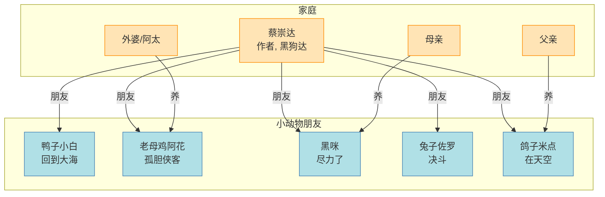

```mermaid
%% 我人生最开始的好朋友 - 人物与小动物关系图
graph TB
    subgraph FAMILY[家庭]
        CAI[蔡崇达<br/>作者, 黑狗达]
        GRANDMA[外婆/阿太]
        MOTHER[母亲]
        FATHER[父亲]
    end
    subgraph ANIMALS[小动物朋友]
        DUCK[鸭子小白<br/>回到大海]
        CHICKEN[老母鸡阿花<br/>孤胆侠客]
        DOG[黑咪<br/>尽力了]
        RABBIT[兔子佐罗<br/>决斗]
        PIGEON[鸽子米点<br/>在天空]
    end
    classDef family fill:#FFE4B5,stroke:#FF8C00
    classDef animal fill:#B0E0E6,stroke:#4682B4
    class CAI,GRANDMA,MOTHER,FATHER family
    class DUCK,CHICKEN,DOG,RABBIT,PIGEON animal
    CAI -->|朋友| DUCK
    CAI -->|朋友| CHICKEN
    CAI -->|朋友| DOG
    CAI -->|朋友| RABBIT
    CAI -->|朋友| PIGEON
    GRANDMA -->|养| CHICKEN
    FATHER -->|养| PIGEON
    MOTHER -->|养| DOG
```
