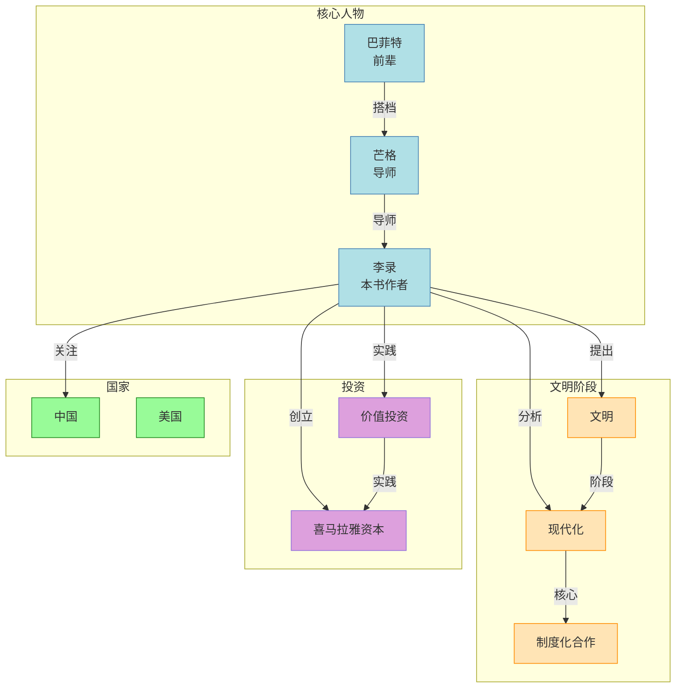

```mermaid
%% 文明、现代化、价值投资与中国 - 核心关系图
graph TB
    subgraph CORE[核心人物]
        LI[李录<br/>本书作者]
        MUNG[芒格<br/>导师]
        BUFF[巴菲特<br/>前辈]
    end
    subgraph CYCLES[文明阶段]
        CIV[文明]
        MOD[现代化]
        INST[制度化合作]
    end
    subgraph INV[投资]
        VAL[价值投资]
        HC[喜马拉雅资本]
    end
    subgraph NATION[国家]
        CHINA[中国]
        USA[美国]
    end
    LI -->|提出| CIV
    LI -->|分析| MOD
    LI -->|实践| VAL
    LI -->|创立| HC
    LI -->|关注| CHINA
    MUNG -->|导师| LI
    BUFF -->|搭档| MUNG
    CIV -->|阶段| MOD
    MOD -->|核心| INST
    VAL -->|实践| HC
    classDef core fill:#B0E0E6,stroke:#4682B4
    classDef cycles fill:#FFE4B5,stroke:#FF8C00
    classDef inv fill:#DDA0DD,stroke:#9370DB
    classDef nation fill:#98FB98,stroke:#228B22
    class LI,MUNG,BUFF core
    class CIV,MOD,INST cycles
    class VAL,HC inv
    class CHINA,USA nation
```
