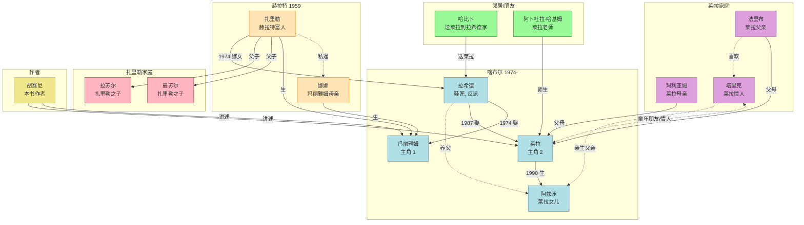

```mermaid
%% 灿烂千阳 - 人物关系图
graph TB
    subgraph HERAT[赫拉特 1959]
        JALIL[扎里勒<br/>赫拉特富人]
        NANA[娜娜<br/>玛丽雅姆母亲]
    end
    subgraph KABUL[喀布尔 1974-]
        RASHEED[拉希德<br/>鞋匠, 反派]
        MARIAM[玛丽雅姆<br/>主角 1]
        LAILA[莱拉<br/>主角 2]
        AZIZA[阿兹莎<br/>莱拉女儿]
    end
    subgraph LAILA_FAM[莱拉家庭]
        FARIB[法里布<br/>莱拉父亲]
        MAMI[玛利亚姆<br/>莱拉母亲]
        TARIQ[塔里克<br/>莱拉情人]
    end
    subgraph HOSSEINI_FAM[扎里勒家庭]
        MANSOOR[曼苏尔<br/>扎里勒之子]
        RASOUL[拉苏尔<br/>扎里勒之子]
    end
    subgraph NEIGHBORS[邻居/朋友]
        HABIB[哈比卜<br/>送莱拉到拉希德家]
        ABDULLAH[阿卜杜拉·哈基姆<br/>莱拉老师]
    end
    subgraph AUTHOR[作者]
        HOSSEINI[胡赛尼<br/>本书作者]
    end
    JALIL -.->|私通| NANA
    JALIL -->|生| MARIAM
    NANA -->|生| MARIAM
    JALIL -->|父子| MANSOOR
    JALIL -->|父子| RASOUL
    FARIB -->|父母| LAILA
    MAMI -->|父母| LAILA
    TARIQ <-.->|童年朋友/情人| LAILA
    FARIB -.->|喜欢| TARIQ
    JALIL -->|1974 嫁女| RASHEED
    RASHEED -->|1974 娶| MARIAM
    RASHEED -->|1987 娶| LAILA
    LAILA -->|1990 生| AZIZA
    TARIQ -.->|亲生父亲| AZIZA
    RASHEED -.->|养父| AZIZA
    HABIB -->|送莱拉| RASHEED
    ABDULLAH -->|师生| LAILA
    HOSSEINI -->|讲述| MARIAM
    HOSSEINI -->|讲述| LAILA
    classDef herat fill:#FFE4B5,stroke:#FF8C00
    classDef kabul fill:#B0E0E6,stroke:#4682B4
    classDef lailafam fill:#DDA0DD,stroke:#9370DB
    classDef hosfam fill:#FFB6C1,stroke:#DC143C
    classDef neigh fill:#98FB98,stroke:#228B22
    classDef author fill:#F0E68C,stroke:#BDB76B
    class JALIL,NANA herat
    class RASHEED,MARIAM,LAILA,AZIZA kabul
    class FARIB,MAMI,TARIQ lailafam
    class MANSOOR,RASOUL hosfam
    class HABIB,ABDULLAH neigh
    class HOSSEINI author
```
