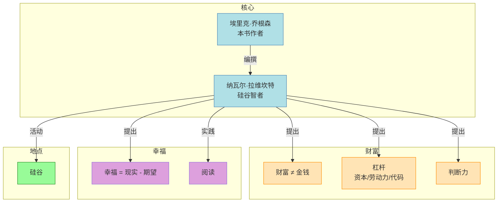

```mermaid
%% 纳瓦尔宝典 - 核心概念关系图
graph TB
    subgraph CORE[核心]
        NAVAL[纳瓦尔·拉维坎特<br/>硅谷智者]
        ERIC[埃里克·乔根森<br/>本书作者]
    end
    subgraph WEALTH[财富]
        CONCEPT_W[财富 ≠ 金钱]
        CONCEPT_L[杠杆<br/>资本/劳动力/代码]
        CONCEPT_J[判断力]
    end
    subgraph HAPPY[幸福]
        CONCEPT_H[幸福 = 现实 - 期望]
        CONCEPT_R[阅读]
    end
    subgraph PLACES[地点]
        SV[硅谷]
    end
    NAVAL -->|提出| CONCEPT_W
    NAVAL -->|提出| CONCEPT_L
    NAVAL -->|提出| CONCEPT_J
    NAVAL -->|提出| CONCEPT_H
    NAVAL -->|实践| CONCEPT_R
    NAVAL -->|活动| SV
    ERIC -->|编撰| NAVAL
    classDef core fill:#B0E0E6,stroke:#4682B4
    classDef wealth fill:#FFE4B5,stroke:#FF8C00
    classDef happy fill:#DDA0DD,stroke:#9370DB
    classDef places fill:#98FB98,stroke:#228B22
    class NAVAL,ERIC core
    class CONCEPT_W,CONCEPT_L,CONCEPT_J wealth
    class CONCEPT_H,CONCEPT_R happy
    class SV places
```
