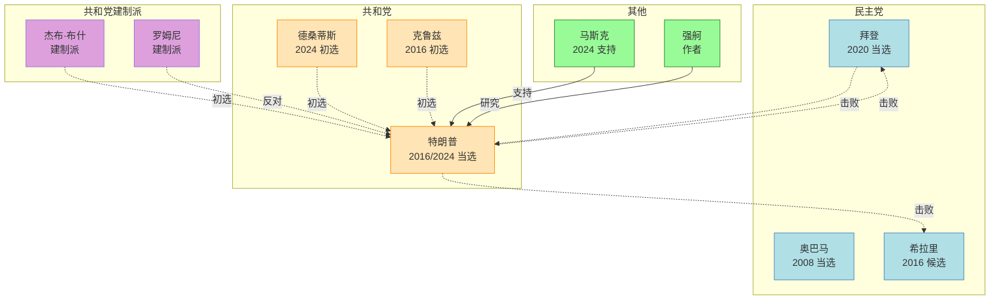

```mermaid
%% 美国困局 - 人物关系图
graph TB
    subgraph DEM[民主党]
        BIDEN[拜登<br/>2020 当选]
        OBAMA[奥巴马<br/>2008 当选]
        HILLARY[希拉里<br/>2016 候选]
    end
    subgraph REP[共和党]
        TRUMP[特朗普<br/>2016/2024 当选]
        DESANTIS[德桑蒂斯<br/>2024 初选]
        CRUZ[克鲁兹<br/>2016 初选]
    end
    subgraph EST[共和党建制派]
        BUSH[杰布·布什<br/>建制派]
        ROMNEY[罗姆尼<br/>建制派]
    end
    subgraph OTHER[其他]
        MUSK[马斯克<br/>2024 支持]
        QIANG[强舸<br/>作者]
    end
    TRUMP -.->|击败| HILLARY
    BIDEN -.->|击败| TRUMP
    TRUMP -.->|击败| BIDEN
    BUSH -.->|初选| TRUMP
    CRUZ -.->|初选| TRUMP
    DESANTIS -.->|初选| TRUMP
    ROMNEY -.->|反对| TRUMP
    MUSK -->|支持| TRUMP
    QIANG -->|研究| TRUMP
    classDef dem fill:#B0E0E6,stroke:#4682B4
    classDef rep fill:#FFE4B5,stroke:#FF8C00
    classDef est fill:#DDA0DD,stroke:#9370DB
    classDef other fill:#98FB98,stroke:#228B22
    class BIDEN,OBAMA,HILLARY dem
    class TRUMP,DESANTIS,CRUZ rep
    class BUSH,ROMNEY est
    class MUSK,QIANG other
```
