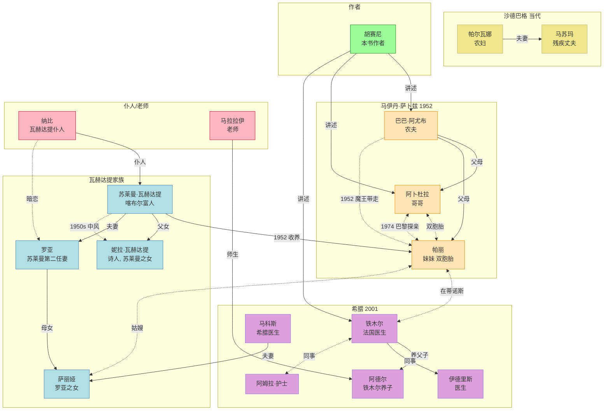

```mermaid
%% 群山回唱 - 人物关系图
graph TB
    subgraph ORIGINAL[马伊丹·萨卜兹 1952]
        BABA[巴巴·阿尤布<br/>农夫]
        ABDULLAH[阿卜杜拉<br/>哥哥]
        PARI[帕丽<br/>妹妹 双胞胎]
    end
    subgraph WAHDATI[瓦赫达提家族]
        SULEIMAN[苏莱曼·瓦赫达提<br/>喀布尔富人]
        NILA[妮拉·瓦赫达提<br/>诗人, 苏莱曼之女]
        ROYA[罗亚<br/>苏莱曼第二任妻]
        SAIRA[萨丽娅<br/>罗亚之女]
    end
    subgraph SHADBAGH[沙德巴格 当代]
        PARWANA[帕尔瓦娜<br/>农妇]
        MASUMA[马苏玛<br/>残疾丈夫]
    end
    subgraph GREECE[希腊 2001]
        TIMM[铁木尔<br/>法国医生]
        ADEL[阿德尔<br/>铁木尔养子]
        IDRIS[伊德里斯<br/>医生]
        MARKOS[马科斯<br/>希腊医生]
        AMRA[阿姆拉·护士]
    end
    subgraph SERVICE[仆人/老师]
        NABI[纳比<br/>瓦赫达提仆人]
        MALALAI[马拉拉伊<br/>老师]
    end
    subgraph AUTHOR[作者]
        HOSSEINI[胡赛尼<br/>本书作者]
    end
    BABA -->|父母| ABDULLAH
    BABA -->|父母| PARI
    ABDULLAH <-.->|双胞胎| PARI
    BABA -.->|1952 魔王带走| PARI
    SULEIMAN -->|1952 收养| PARI
    SULEIMAN -->|父女| NILA
    SULEIMAN -->|夫妻| ROYA
    ROYA -->|母女| SAIRA
    SULEIMAN -.->|1950s 中风| NILA
    PARI <-.->|1974 巴黎探亲| ABDULLAH
    NABI -->|仆人| SULEIMAN
    NABI -.->|暗恋| ROYA
    PARWANA -->|夫妻| MASUMA
    TIMM -->|养父子| ADEL
    TIMM -->|同事| IDRIS
    TIMM <-.->|同事| AMRA
    MARKOS -->|夫妻| SAIRA
    MALALAI -->|师生| ADEL
    PARI <-.->|在蒂诺斯| TIMM
    PARI <-.->|姑嫂| SAIRA
    HOSSEINI -->|讲述| BABA
    HOSSEINI -->|讲述| ABDULLAH
    HOSSEINI -->|讲述| TIMM
    classDef original fill:#FFE4B5,stroke:#FF8C00
    classDef wahdati fill:#B0E0E6,stroke:#4682B4
    classDef shadba fill:#F0E68C,stroke:#BDB76B
    classDef greece fill:#DDA0DD,stroke:#9370DB
    classDef service fill:#FFB6C1,stroke:#DC143C
    classDef author fill:#98FB98,stroke:#228B22
    class BABA,ABDULLAH,PARI original
    class SULEIMAN,NILA,ROYA,SAIRA wahdati
    class PARWANA,MASUMA shadba
    class TIMM,ADEL,IDRIS,MARKOS,AMRA greece
    class NABI,MALALAI service
    class HOSSEINI author
```
