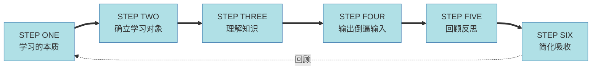

```mermaid
%% 费曼学习法 - 6 STEPs 流程图
graph LR
    STEP1[STEP ONE<br/>学习的本质]:::step
    STEP2[STEP TWO<br/>确立学习对象]:::step
    STEP3[STEP THREE<br/>理解知识]:::step
    STEP4[STEP FOUR<br/>输出倒逼输入]:::step
    STEP5[STEP FIVE<br/>回顾反思]:::step
    STEP6[STEP SIX<br/>简化吸收]:::step
    STEP1 ==> STEP2
    STEP2 ==> STEP3
    STEP3 ==> STEP4
    STEP4 ==> STEP5
    STEP5 ==> STEP6
    STEP6 -.->|回顾| STEP1
    classDef step fill:#B0E0E6,stroke:#4682B4
```
