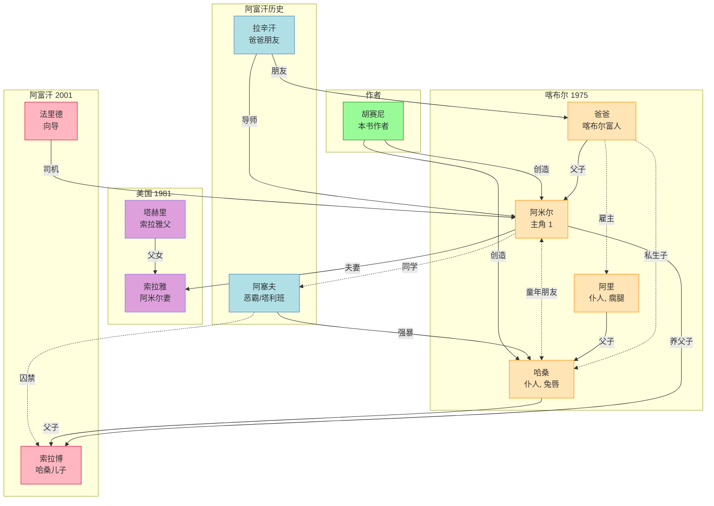

```mermaid
%% 追风筝的人 - 人物关系图
graph TB
    subgraph FAMILY[喀布尔 1975]
        BABA[爸爸<br/>喀布尔富人]
        AMIR[阿米尔<br/>主角 1]
        ALI[阿里<br/>仆人, 瘸腿]
        HASSAN[哈桑<br/>仆人, 兔唇]
    end
    subgraph AFGHAN_HISTORY[阿富汗历史]
        RAHIM[拉辛汗<br/>爸爸朋友]
        ASSAF[阿塞夫<br/>恶霸/塔利班]
    end
    subgraph SF[美国 1981-]
        SORAYA[索拉雅<br/>阿米尔妻]
        TAHERI[塔赫里<br/>索拉雅父]
    end
    subgraph AFGHAN_2001[阿富汗 2001]
        FARID[法里德<br/>向导]
        SOHRAB[索拉博<br/>哈桑儿子]
    end
    subgraph AUTHOR[作者]
        HOSSEINI[胡赛尼<br/>本书作者]
    end
    BABA -->|父子| AMIR
    BABA -.->|私生子| HASSAN
    ALI -->|父子| HASSAN
    AMIR <-.->|童年朋友| HASSAN
    RAHIM -->|朋友| BABA
    RAHIM -->|导师| AMIR
    ASSAF -->|强暴| HASSAN
    AMIR -.->|同学| ASSAF
    BABA -.->|雇主| ALI
    AMIR -->|夫妻| SORAYA
    TAHERI -->|父女| SORAYA
    FARID -->|司机| AMIR
    AMIR -->|养父子| SOHRAB
    HASSAN -->|父子| SOHRAB
    ASSAF -.->|囚禁| SOHRAB
    HOSSEINI -->|创造| AMIR
    HOSSEINI -->|创造| HASSAN
    classDef family fill:#FFE4B5,stroke:#FF8C00
    classDef hist fill:#B0E0E6,stroke:#4682B4
    classDef sf fill:#DDA0DD,stroke:#9370DB
    classDef afg fill:#FFB6C1,stroke:#DC143C
    classDef author fill:#98FB98,stroke:#228B22
    class BABA,AMIR,ALI,HASSAN family
    class RAHIM,ASSAF hist
    class SORAYA,TAHERI sf
    class FARID,SOHRAB afg
    class HOSSEINI author
```
