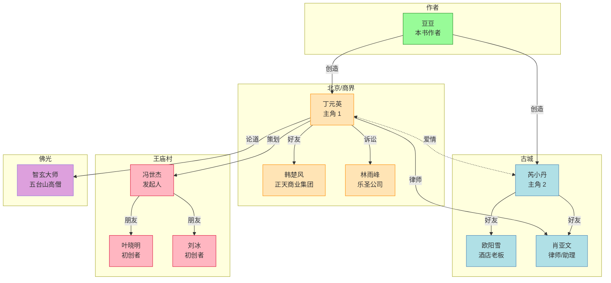

```mermaid
%% 遥远的救世主 - 人物关系图
graph TB
    subgraph BEIJING[北京/商界]
        DING[丁元英<br/>主角 1]
        HAN[韩楚风<br/>正天商业集团]
        LIN[林雨峰<br/>乐圣公司]
    end
    subgraph GUCHENG[古城]
        RUI[芮小丹<br/>主角 2]
        OUYANG[欧阳雪<br/>酒店老板]
        XIAO[肖亚文<br/>律师/助理]
    end
    subgraph WANGMIAO[王庙村]
        FENG[冯世杰<br/>发起人]
        YE[叶晓明<br/>初创者]
        LIU[刘冰<br/>初创者]
    end
    subgraph FOGUANG[佛光]
        ZHIXUAN[智玄大师<br/>五台山高僧]
    end
    subgraph AUTHOR[作者]
        DOUDOU[豆豆<br/>本书作者]
    end
    DING <-.->|爱情| RUI
    DING -->|好友| HAN
    DING -->|诉讼| LIN
    RUI -->|好友| OUYANG
    RUI -->|好友| XIAO
    DING -->|律师| XIAO
    DING -->|策划| FENG
    FENG -->|朋友| YE
    FENG -->|朋友| LIU
    DING -->|论道| ZHIXUAN
    DOUDOU -->|创造| DING
    DOUDOU -->|创造| RUI
    classDef beijing fill:#FFE4B5,stroke:#FF8C00
    classDef gucheng fill:#B0E0E6,stroke:#4682B4
    classDef wangmiao fill:#FFB6C1,stroke:#DC143C
    classDef foguang fill:#DDA0DD,stroke:#9370DB
    classDef author fill:#98FB98,stroke:#228B22
    class DING,HAN,LIN beijing
    class RUI,OUYANG,XIAO gucheng
    class FENG,YE,LIU wangmiao
    class ZHIXUAN foguang
    class DOUDOU author
```
