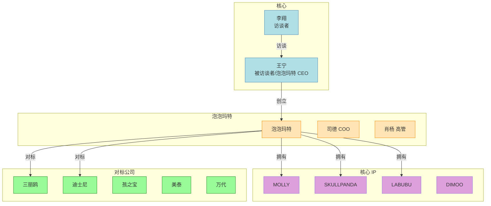

```mermaid
%% 因为独特 - 概念关系图
graph TB
    subgraph CORE[核心]
        LI[李翔<br/>访谈者]
        WN[王宁<br/>被访谈者/泡泡玛特 CEO]
    end
    subgraph POP[泡泡玛特]
        POPMART[泡泡玛特]
        SD[司德 COO]
        XY[肖杨 高管]
    end
    subgraph IP[核心 IP]
        MOLLY[MOLLY]
        SKULL[SKULLPANDA]
        LABU[LABUBU]
        DIMOO[DIMOO]
    end
    subgraph COMP[对标公司]
        SAN[三丽鸥]
        DIS[迪士尼]
        HAS[孩之宝]
        MAT[美泰]
        BAN[万代]
    end
    LI -->|访谈| WN
    WN -->|创立| POPMART
    POPMART -->|拥有| MOLLY
    POPMART -->|拥有| SKULL
    POPMART -->|拥有| LABU
    POPMART -->|对标| SAN
    POPMART -->|对标| DIS
    classDef core fill:#B0E0E6,stroke:#4682B4
    classDef pop fill:#FFE4B5,stroke:#FF8C00
    classDef ip fill:#DDA0DD,stroke:#9370DB
    classDef comp fill:#98FB98,stroke:#228B22
    class LI,WN core
    class POPMART,SD,XY pop
    class MOLLY,SKULL,LABU,DIMOO ip
    class SAN,DIS,HAS,MAT,BAN comp
```
