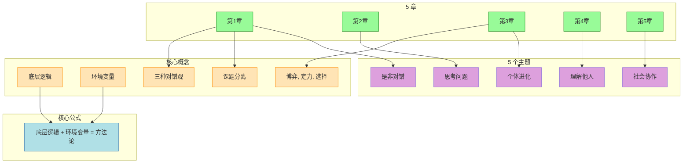

```mermaid
%% 底层逻辑 - 概念关系图
graph TB
    subgraph CORE[核心公式]
        CORE_F[底层逻辑 + 环境变量 = 方法论]
    end
    subgraph CONCEPT[核心概念]
        LOGIC[底层逻辑]
        ENV[环境变量]
        RIGHT[三种对错观]
        KETI[课题分离]
        WIS[博弈, 定力, 选择]
    end
    subgraph THEME[5 个主题]
        T1[是非对错]
        T2[思考问题]
        T3[个体进化]
        T4[理解他人]
        T5[社会协作]
    end
    subgraph CH[5 章]
        C1[第1章]
        C2[第2章]
        C3[第3章]
        C4[第4章]
        C5[第5章]
    end
    LOGIC --> CORE_F
    ENV --> CORE_F
    C1 --> RIGHT
    C1 --> KETI
    C3 --> WIS
    C1 --> T1
    C2 --> T2
    C3 --> T3
    C4 --> T4
    C5 --> T5
    classDef core fill:#B0E0E6,stroke:#4682B4
    classDef concept fill:#FFE4B5,stroke:#FF8C00
    classDef theme fill:#DDA0DD,stroke:#9370DB
    classDef ch fill:#98FB98,stroke:#228B22
    class CORE_F core
    class LOGIC,ENV,RIGHT,KETI,WIS concept
    class T1,T2,T3,T4,T5 theme
    class C1,C2,C3,C4,C5 ch
```
