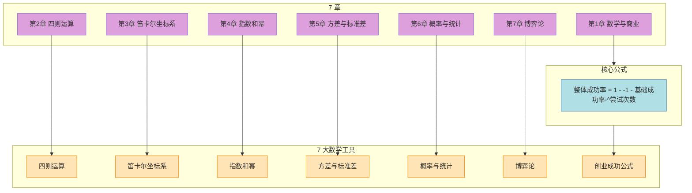

```mermaid
%% 底层逻辑2 - 概念关系图
graph TB
    subgraph CORE[核心公式]
        FORMULA[整体成功率 = 1 - -1 - 基础成功率-^尝试次数]
    end
    subgraph MATH[7 大数学工具]
        S1[四则运算]
        S2[笛卡尔坐标系]
        S3[指数和幂]
        S4[方差与标准差]
        S5[概率与统计]
        S6[博弈论]
        S7[创业成功公式]
    end
    subgraph CH[7 章]
        C1[第1章 数学与商业]
        C2[第2章 四则运算]
        C3[第3章 笛卡尔坐标系]
        C4[第4章 指数和幂]
        C5[第5章 方差与标准差]
        C6[第6章 概率与统计]
        C7[第7章 博弈论]
    end
    CORE --> S7
    C1 --> CORE
    C2 --> S1
    C3 --> S2
    C4 --> S3
    C5 --> S4
    C6 --> S5
    C7 --> S6
    classDef core fill:#B0E0E6,stroke:#4682B4
    classDef math fill:#FFE4B5,stroke:#FF8C00
    classDef ch fill:#DDA0DD,stroke:#9370DB
    class FORMULA core
    class S1,S2,S3,S4,S5,S6,S7 math
    class C1,C2,C3,C4,C5,C6,C7 ch
```
