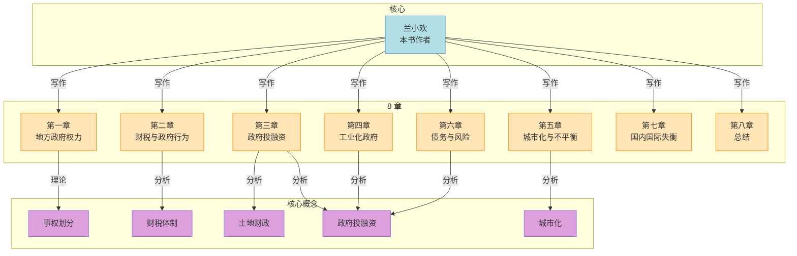

```mermaid
%% 置身事内 - 概念关系图
graph TB
    subgraph CORE[核心]
        LAN[兰小欢<br/>本书作者]
    end
    subgraph CH[8 章]
        C1[第一章<br/>地方政府权力]
        C2[第二章<br/>财税与政府行为]
        C3[第三章<br/>政府投融资]
        C4[第四章<br/>工业化政府]
        C5[第五章<br/>城市化与不平衡]
        C6[第六章<br/>债务与风险]
        C7[第七章<br/>国内国际失衡]
        C8[第八章<br/>总结]
    end
    subgraph CONCEPT[核心概念]
        SHI[事权划分]
        CAI[财税体制]
        TUD[土地财政]
        TOU[政府投融资]
        CHEN[城市化]
    end
    LAN -->|写作| C1
    LAN -->|写作| C2
    LAN -->|写作| C3
    LAN -->|写作| C4
    LAN -->|写作| C5
    LAN -->|写作| C6
    LAN -->|写作| C7
    LAN -->|写作| C8
    C1 -->|理论| SHI
    C2 -->|分析| CAI
    C3 -->|分析| TUD
    C3 -->|分析| TOU
    C4 -->|分析| TOU
    C5 -->|分析| CHEN
    C6 -->|分析| TOU
classDef core fill:#B0E0E6,stroke:#4682B4
classDef ch fill:#FFE4B5,stroke:#FF8C00
classDef concept fill:#DDA0DD,stroke:#9370DB
class LAN core
class C1,C2,C3,C4,C5,C6,C7,C8 ch
class SHI,CAI,TUD,TOU,CHEN concept
```
