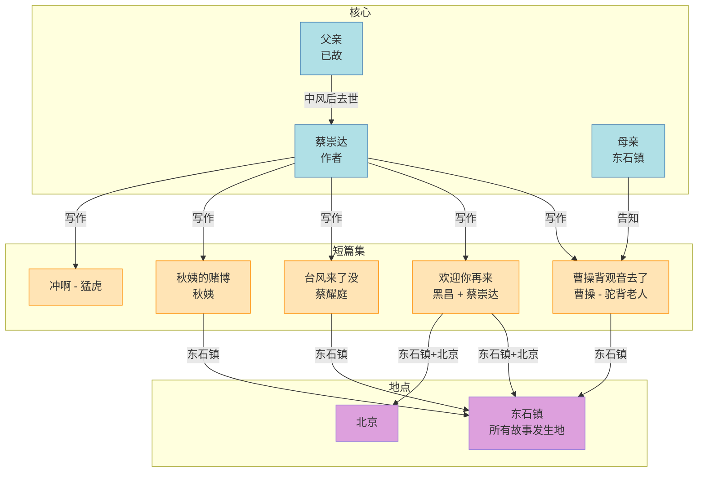

```mermaid
%% 草民 - 人物关系图
graph TB
    subgraph CORE[核心]
        CAI[蔡崇达<br/>作者]
        MOTHER[母亲<br/>东石镇]
        FATHER[父亲<br/>已故]
    end
    subgraph STORIES[短篇集]
        S1[曹操背观音去了<br/>曹操 - 驼背老人]
        S2[欢迎你再来<br/>黑昌 + 蔡崇达]
        S3[台风来了没<br/>蔡耀庭]
        S4[秋姨的赌博<br/>秋姨]
        S5[冲啊 - 猛虎]
    end
    subgraph PLACE[地点]
        DONGSHI[东石镇<br/>所有故事发生地]
        BEIJING[北京]
    end
    CAI -->|写作| S1
    CAI -->|写作| S2
    CAI -->|写作| S3
    CAI -->|写作| S4
    CAI -->|写作| S5
    MOTHER -->|告知| S1
    FATHER -->|中风后去世| CAI
    S1 -->|东石镇| DONGSHI
    S2 -->|东石镇+北京| DONGSHI
    S2 -->|东石镇+北京| BEIJING
    S3 -->|东石镇| DONGSHI
    S4 -->|东石镇| DONGSHI
    classDef core fill:#B0E0E6,stroke:#4682B4
    classDef story fill:#FFE4B5,stroke:#FF8C00
    classDef place fill:#DDA0DD,stroke:#9370DB
    class CAI,MOTHER,FATHER core
    class S1,S2,S3,S4,S5 story
    class DONGSHI,BEIJING place
```
