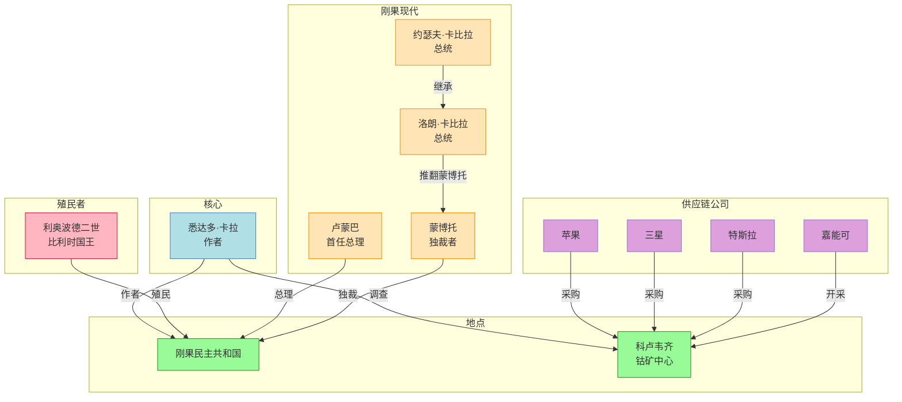

```mermaid
%% 血钴 - 人物关系图
graph TB
    subgraph CORE[核心]
        KARA[悉达多·卡拉<br/>作者]
    end
    subgraph COL[殖民者]
        LEO[利奥波德二世<br/>比利时国王]
    end
    subgraph DC[刚果现代]
        LUM[卢蒙巴<br/>首任总理]
        MOB[蒙博托<br/>独裁者]
        LAU[洛朗·卡比拉<br/>总统]
        JOS[约瑟夫·卡比拉<br/>总统]
    end
    subgraph CORP[供应链公司]
        APPLE[苹果]
        SAM[三星]
        TESLA[特斯拉]
        GLE[嘉能可]
    end
    subgraph PLACE[地点]
        DRC[刚果民主共和国]
        KOL[科卢韦齐<br/>钴矿中心]
    end
    KARA -->|作者| DRC
    LEO -->|殖民| DRC
    LUM -->|总理| DRC
    MOB -->|独裁| DRC
    LAU -->|推翻蒙博托| MOB
    JOS -->|继承| LAU
    KARA -->|调查| KOL
    APPLE -->|采购| KOL
    SAM -->|采购| KOL
    TESLA -->|采购| KOL
    GLE -->|开采| KOL
    classDef core fill:#B0E0E6,stroke:#4682B4
    classDef col fill:#FFB6C1,stroke:#DC143C
    classDef dc fill:#FFE4B5,stroke:#FF8C00
    classDef corp fill:#DDA0DD,stroke:#9370DB
    classDef place fill:#98FB98,stroke:#228B22
    class KARA core
    class LEO col
    class LUM,MOB,LAU,JOS dc
    class APPLE,SAM,TESLA,GLE corp
    class DRC,KOL place
```
