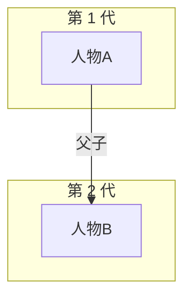

# 实体抽取模板 (LLM 工作单)

## 路径变量

- `<SCRATCH>` - EPUB spine 抽取目录 (e.g. `/tmp/literary-scratch/`)
- `<WORK_DIR>` - LLM 工作目录 (用于存放中间 JSON, e.g. `/tmp/`)
- `<VAULT_PATH>` - 最终 vault 输出目录

## 概述

本模板指导 LLM (Agent) 如何从 EPUB spine 抽取实体, 输出符合 skill schema 的 JSON, 然后通过 `s50_build_vault.py --xxx-json=<file>` 注入。

---

## 通用 Schema

### 1. 人物档案 (people)

```json
[
  {
    "name": "人物名 (中文/原名)",
    "content": "---\ntitle: 人物名\nbook: <书名>\ntype: character\ncreated: 2026-07-20\ntags: [person, character, 角色类型]\n---\n\n# 人物名\n\n## 简介\n\n200-500 字简介\n\n## 关键事件\n\n1. 时间: 事件\n2. 时间: 事件\n\n## 关键人物关系\n\n- [[人物X]] (关系类型)\n\n## 关联人物\n\n- [[出版人]]"
  }
]
```

### 2. 概念 (concepts)

```json
[
  {
    "name": "概念名",
    "content": "---\ntitle: 概念名\nbook: <书名>\ntype: concept\ncreated: 2026-07-20\ntags: [concept, 主题类型]\n---\n\n# 概念名\n\n## 简介\n\n200-500 字简介\n\n## 关键事件/例子\n\n## 关联人物\n\n- [[人物X]]"
  }
]
```

### 3. 主题 (themes)

```json
[
  {
    "name": "主题名",
    "content": "---\ntitle: 主题名\nbook: <书名>\ntype: theme\ncreated: 2026-07-20\ntags: [theme, 类型]\n---\n\n# 主题: 主题名\n\n## 核心命题\n\n描述\n\n## 关键证据\n\n- [[章节X]]\n- [[人物Y]]\n\n## 关联人物\n\n- [[人物X]]"
  }
]
```

### 4. 摘录 (quotes)

```json
[
  {
    "name": "NN-标题",
    "content": "---\ntitle: 标题\nbook: <书名>\ntype: quote\ncreated: 2026-07-20\ntags: [quote]\n---\n\n# 摘录 NN: 标题\n\n> 原文摘录\n> —— 出处/章节\n\n## 上下文\n\n描述"
  }
]
```

### 5. 章节笔记 (chapters)

```json
[
  {
    "name": "NN-第N章",
    "part": "1-第一部" (T1 文学) 或 null,
    "content": "---\ntitle: 第N章\nbook: <书名>\ntype: chapter\ncreated: 2026-07-20\ntags: [chapter, 年份, 地点]\n---\n\n# NN-第N章\n\n## 场景\n\n地点 | 时间\n\n## 关键事件\n\n1. 事件\n\n## 关键引用\n\n> 引用\n\n## 人物\n\n- [[人物X]]\n\n## 主题\n\n- 主题1\n- 主题2\n\n## 与其他章的连接\n\n描述"
  }
]
```

### 6. Mermaid (mermaid_content)

完整 markdown 文件内容:
```markdown


**关键人物**
- ...
```

### 7. MOC (moc_content)

完整 markdown 文件内容:
```markdown
---
title: 读书脑图
book: <书名>
type: moc
created: 2026-07-20
tags: [moc, T1, 小说]
---

# 《<书名>》读书脑图

## 书籍信息
1. 作者
2. 译者
3. **类型: T1 文学 - 小说**
4. **字数: 21.6 万字**

## 豆瓣数据
...

## 阅读方式
1. 顺序阅读
2. 精读
...

## 章节结构
- [[01-第一章]]
...

## 涉及人物
- [[人物A]]
...

## 核心概念
- [[概念X]]
...

## 主题
- [[主题-XXX]]
...

## 关键摘录
- [[摘录-01-XXX]]
...

## 阅读路径
...

## 关系图
[[人物关系图.mermaid]]
```

---

## 调用流程

1. **LLM 读 EPUB spine**: `<SCRATCH>/<书名>/spine/*.txt`
2. **LLM 按 schema 生成 6 个 JSON**: 写到 `<WORK_DIR>/<书名>_entities/*.json`
3. **调用 skill 填充 vault**:
```bash
python3 ~/.hermes/skills/productivity/book-vault-analysis/scripts/s50_build_vault.py \
  <VAULT_PATH> \
  --type=T1 \
  --scratch=<SCRATCH>/<书名> \
  --people-json=<WORK_DIR>/<书名>_entities/people.json \
  --concepts-json=<WORK_DIR>/<书名>_entities/concepts.json \
  --themes-json=<WORK_DIR>/<书名>_entities/themes.json \
  --quotes-json=<WORK_DIR>/<书名>_entities/quotes.json \
  --chapters-json=<WORK_DIR>/<书名>_entities/chapters.json \
  --mermaid-content=<WORK_DIR>/<书名>_entities/mermaid.md \
  --moc-content=<WORK_DIR>/<书名>_entities/moc.md
```
4. **运行 L1 + L2 验证**

---

## 类型变体

### T1 文学
- 必含: people (12-30), concepts (5-8), themes (5), quotes (5), chapters (全部章节)
- 章节按"部"分组, part 字段必填

### T2 思想史/哲学
- 必含: thinkers (10-20), concepts (8-15), themes (3-5), quotes (5)
- thinkers 写入 `思想家/` 子目录

### T3 方法论
- 必含: concepts (8-12), methods (5-8), steps (按书的步骤), themes (5), quotes (5)

### T4 投资
- 必含: thinkers (5-10), theories (5-8), models (3-5), cases (3-5), themes (5)

### T5 商业
- 必含: principles (10-15), cases (5-10), themes (5)

### T14 混合
- 跨两个类型 (e.g., 文学+哲学)
- 概念 = 文学 + 哲学 混合
- themes 反映双主题