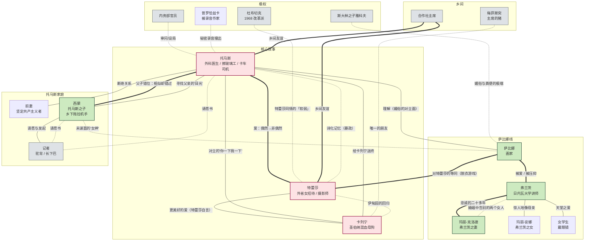

# 人物关系图（Mermaid）

## 节点说明

- **核心人物**（浅红）：托马斯、特蕾莎、卡列宁
- **重要人物**（浅绿）：萨比娜、弗兰茨、玛丽-克洛德、西蒙
- **极权/对照**（灰）：内务部官员、记者、杜布切克、斯大林之子

## 边线说明

- **粗实线**（`===`）：主要情感关系（爱 / 真正的友谊）
- **细实线**（`---`）：次要关系（依附 / 影响 / 注视）
- **虚线**（`-.->`）：隐含 / 未直接见面的影响

## 关键关系说明

### 托马斯 ↔ 特蕾莎

- 关系由“偶然的 6 次巧合”开始。
- 特蕾莎对托马斯的爱既是“灵魂的依赖”也是“咄咄逼人的弱者武器”。
- 托马斯最终放弃手术台陪她到乡下。
- 死因：山间卡车翻入深谷。

### 特蕾莎 ↔ 卡列宁

- 母亲世界 → 卡列宁世界的反叛。
- “她与卡列宁之间的爱更美好，而不是更伟大”。

### 萨比娜 ↔ 弗兰茨

- 弗兰茨的“伟大进军”在他心中从未结束；他追求的“目标”其实一直指向萨比娜的“目光”。
- 萨比娜在曼谷的最后一夜与弗兰茨“幻影般的目光”重合。

### 托马斯 ↔ 西蒙

- 父子之间几乎从未直接对话。
- 唯一一次会面是西蒙带记者来访。
- 碑文：“他要尘世间的上帝之国。”

### 梅菲斯突 ↔ 卡列宁

- 关键性的对照：被“当狗养”的猪 vs 真正的狗。
- 卡列宁的“循环时间”= 伊甸园；
- 梅菲斯突 = 被改造的“机器动物”。

## 用法

- 在 Obsidian 中打开此文件，启用 Mermaid 插件即可查看。
- 在 GitHub 中可自动渲染。
- 也可复制到 https://mermaid.live/ 进行交互式编辑。
