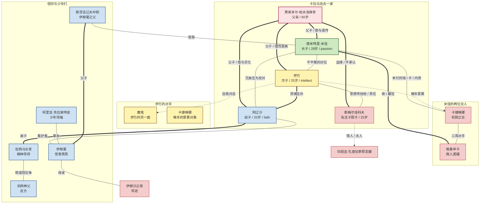

# 人物关系图（Mermaid）

## 节点说明

| 类别 | 颜色 | 包含人物 |
|---|---|---|
| 卡拉马佐夫一家（核心） | 浅红 | 费奥多尔、米佳、伊万、阿辽沙、斯梅尔佳科夫 |
| 信仰与少年们 | 浅蓝 | 阿辽沙、佐西马、派西神父、柯里亚、伊柳夏、斯涅吉辽夫中尉 |
| 智识（伊万路径） | 浅黄 | 伊万、魔鬼、卡捷琳娜 |
| 激情（米佳路径） | 浅绿 | 米佳 |
| 配角 | 浅灰 | 卡捷琳娜、格鲁申卡、玛丽亚·孔德拉季耶芙娜、伊柳沙之母 |

## 关系类型说明

- **实线 / `=== `**：明确的家庭或情感关系
- **普通线 / `--- `**：敌对、债务或紧张关系
- **虚线 / `-.-> `**：暗示、影响、思想传递、不正式

## 关联

- 详细档案 → [[人物档案总览]]
- 时间线 → [[时间线]]
