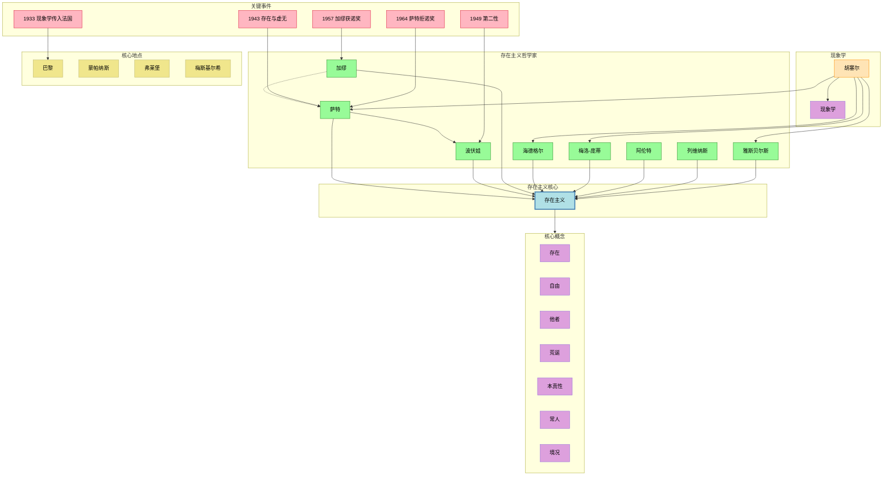

```mermaid
%% 存在主义咖啡馆 - 思想影响关系图
graph TB
    subgraph CORE[存在主义核心]
        EX[存在主义]
    end

    subgraph PHENOMENOLOGY[现象学]
        HUSSERL[胡塞尔]
        HUSSERL --> PHEN[现象学]
    end

    subgraph EXISTENTIALISM[存在主义哲学家]
        SARTRE[萨特]
        BEAUVOIR[波伏娃]
        CAMUS[加缪]
        HEIDEGGER[海德格尔]
        MERLEAU[梅洛-庞蒂]
        JASPERS[雅斯贝尔斯]
        ARENDT[阿伦特]
        LEVINAS[列维纳斯]
    end

    subgraph CORE_CONCEPTS[核心概念]
        BEING[存在]
        FREEDOM[自由]
        PHEN[现象学]
        OTHER[他者]
        ABSURD[荒诞]
        AUTHENTIC[本真性]
        DASEIN[常人]
        SITUATION[境况]
    end

    subgraph KEY_EVENTS[关键事件]
        E1933[1933 现象学传入法国]
        E1943[1943 存在与虚无]
        E1949[1949 第二性]
        E1957[1957 加缪获诺奖]
        E1964[1964 萨特拒诺奖]
    end

    subgraph PLACES[核心地点]
        PARIS[巴黎]
        MONTPARNASSE[蒙帕纳斯]
        FREIBURG[弗莱堡]
        MESKIRCH[梅斯基尔希]
    end

    HUSSERL --> HEIDEGGER
    HUSSERL --> SARTRE
    HUSSERL --> MERLEAU
    HUSSERL --> JASPERS

    SARTRE --> EX
    BEAUVOIR --> EX
    CAMUS --> EX
    HEIDEGGER --> EX
    MERLEAU --> EX
    ARENDT --> EX
    LEVINAS --> EX
    JASPERS --> EX

    SARTRE --> BEAUVOIR
    CAMUS -.-> SARTRE

    EX --> CORE_CONCEPTS
    E1933 --> PARIS
    E1943 --> SARTRE
    E1949 --> BEAUVOIR
    E1957 --> CAMUS
    E1964 --> SARTRE

    classDef core fill:#B0E0E6,stroke:#4682B4,stroke-width:3px,color:#000
    classDef phenomenology fill:#FFE4B5,stroke:#FF8C00,color:#000
    classDef existentialism fill:#98FB98,stroke:#228B22,color:#000
    classDef concepts fill:#DDA0DD,stroke:#9370DB,color:#000
    classDef events fill:#FFB6C1,stroke:#DC143C,color:#000
    classDef places fill:#F0E68C,stroke:#BDB76B,color:#000
    class EX core
    class HUSSERL,PHEN phenomenology
    class SARTRE,BEAUVOIR,CAMUS,HEIDEGGER,MERLEAU,JASPERS,ARENDT,LEVINAS existentialism
    class BEING,FREEDOM,PHEN,OTHER,ABSURD,AUTHENTIC,DASEIN,SITUATION concepts
    class E1933,E1943,E1949,E1957,E1964 events
    class PARIS,MONTPARNASSE,FREIBURG,MESKIRCH places
```
