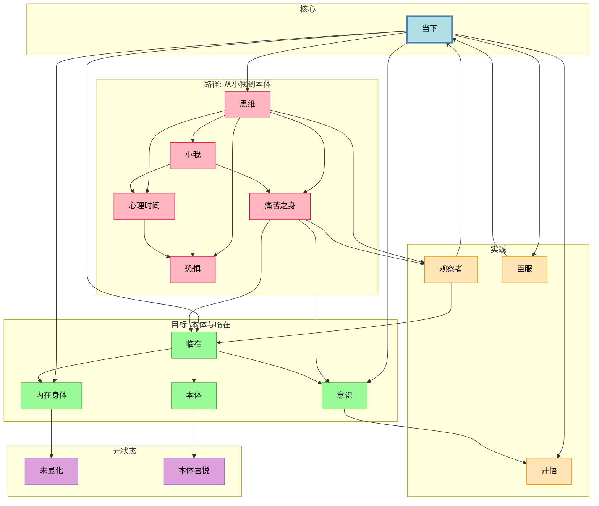

```mermaid
%% 当下的力量 - 概念关系图
graph TB
    subgraph CORE[核心]
        NOW[当下]
    end

    subgraph PATH[路径: 从小我到本体]
        THINK[思维]
        EGO[小我]
        PAIN[痛苦之身]
        TIME[心理时间]
        FEAR[恐惧]
    end

    subgraph GOAL[目标: 本体与临在]
        PRESENCE[临在]
        BEING[本体]
        BODY[内在身体]
        CONSCIOUS[意识]
    end

    subgraph ACTIONS[实践]
        WATCH[观察者]
        SURRENDER[臣服]
        ENLIGHT[开悟]
    end

    subgraph META[元状态]
        UNMANIFEST[未显化]
        JOY[本体喜悦]
    end

    NOW --> PRESENCE
    NOW --> THINK
    NOW --> CONSCIOUS
    NOW --> BODY
    NOW --> SURRENDER
    NOW --> ENLIGHT

    THINK --> EGO
    THINK --> TIME
    THINK --> PAIN
    THINK --> FEAR
    THINK --> WATCH

    EGO --> PAIN
    EGO --> TIME
    EGO --> FEAR
    TIME --> FEAR

    PAIN --> WATCH
    PAIN --> PRESENCE
    PAIN --> CONSCIOUS

    WATCH --> PRESENCE
    PRESENCE --> BEING
    PRESENCE --> BODY
    PRESENCE --> CONSCIOUS
    BODY --> UNMANIFEST
    BEING --> JOY
    CONSCIOUS --> ENLIGHT
    SURRENDER --> NOW
    WATCH --> NOW

    classDef core fill:#B0E0E6,stroke:#4682B4,stroke-width:3px,color:#000
    classDef path fill:#FFB6C1,stroke:#DC143C,color:#000
    classDef goal fill:#98FB98,stroke:#228B22,color:#000
    classDef actions fill:#FFE4B5,stroke:#FF8C00,color:#000
    classDef meta fill:#DDA0DD,stroke:#9370DB,color:#000
    class NOW core
    class THINK,EGO,PAIN,TIME,FEAR path
    class PRESENCE,BEING,BODY,CONSCIOUS goal
    class WATCH,SURRENDER,ENLIGHT actions
    class UNMANIFEST,JOY meta
```
