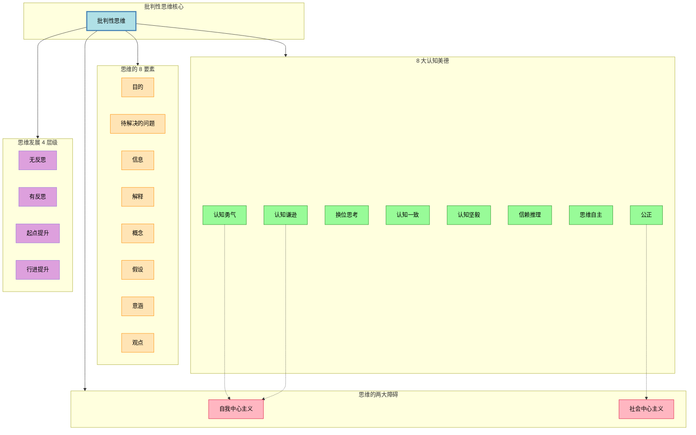

```mermaid
%% 思辨与立场 - 思维要素 8 维关系图
graph TB
    subgraph CORE[批判性思维核心]
        CT[批判性思维]
    end

    subgraph ELEMENTS[思维的 8 要素]
        E1[目的]
        E2[待解决的问题]
        E3[信息]
        E4[解释]
        E5[概念]
        E6[假设]
        E7[意涵]
        E8[观点]
    end

    subgraph VIRTUES[8 大认知美德]
        V1[认知谦逊]
        V2[认知勇气]
        V3[换位思考]
        V4[认知一致]
        V5[认知坚毅]
        V6[信赖推理]
        V7[思维自主]
        V8[公正]
    end

    subgraph BLOCKERS[思维的两大障碍]
        EGO[自我中心主义]
        SOC[社会中心主义]
    end

    subgraph LEVELS[思维发展 4 层级]
        L1[无反思]
        L2[有反思]
        L3[起点提升]
        L4[行进提升]
    end

    CT --> ELEMENTS
    CT --> VIRTUES
    CT --> BLOCKERS
    CT --> LEVELS

    V1 -.-> EGO
    V2 -.-> EGO
    V8 -.-> SOC

    classDef core fill:#B0E0E6,stroke:#4682B4,stroke-width:3px,color:#000
    classDef elements fill:#FFE4B5,stroke:#FF8C00,color:#000
    classDef virtues fill:#98FB98,stroke:#228B22,color:#000
    classDef blockers fill:#FFB6C1,stroke:#DC143C,color:#000
    classDef levels fill:#DDA0DD,stroke:#9370DB,color:#000
    class CT core
    class E1,E2,E3,E4,E5,E6,E7,E8 elements
    class V1,V2,V3,V4,V5,V6,V7,V8 virtues
    class EGO,SOC blockers
    class L1,L2,L3,L4 levels
```
