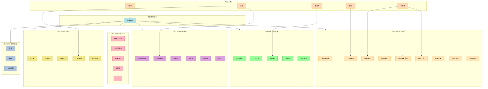

```mermaid
%% 百知思维模型 - 6 部分 101 模型关系图
graph TB
    subgraph CORE[思维模型核心]
        MM[思维模型]
    end

    subgraph PART1[第 1 部分 认知自我]
        M1[马斯洛需求]
        M2[心理账户]
        M3[前景理论]
        M4[框架效应]
        M5[卡尼曼双系统]
        M6[峰终定律]
        M7[首因近因]
        M8[10+10+10]
        M9[总观效应]
    end

    subgraph PART2[第 2 部分 认知世界]
        M10[复利效应]
        M11[二八定律]
        M12[黄金圈]
        M13[护城河]
        M14[三八理论]
    end

    subgraph PART3[第 3 部分 思考分析]
        M15[第一性原理]
        M16[逆向思维]
        M17[笛卡尔]
        M18[5Why]
        M19[6W2H]
        M20[UTC]
    end

    subgraph PART4[第 4 部分 沟通学习]
        M21[费曼学习法]
        M22[六顶思考帽]
        M23[GROW]
        M24[HERO]
        M25[721]
    end

    subgraph PART5[第 5 部分 计划行动]
        M26[PDCA]
        M27[四象限]
        M28[SWOT]
        M29[二阶思维]
        M30[AARRR]
    end

    subgraph PART6[第 6 部分 总结展望]
        M31[复盘]
        M32[GRAI]
        M33[大道至简]
    end

    subgraph PEOPLE[核心人物]
        YUAN[圆中]
        MUNGER[芒格]
        KAHNEMAN[卡尼曼]
        THALER[萨勒]
        SINEK[斯涅克]
    end

    MM --> PART1
    MM --> PART2
    MM --> PART3
    MM --> PART4
    MM --> PART5
    MM --> PART6

    YUAN --> MM
    MUNGER --> M16
    MUNGER --> M29
    KAHNEMAN --> M3
    KAHNEMAN --> M5
    KAHNEMAN --> M6
    THALER --> M2
    SINEK --> M12

    classDef core fill:#B0E0E6,stroke:#4682B4,stroke-width:3px,color:#000
    classDef part1 fill:#FFE4B5,stroke:#FF8C00,color:#000
    classDef part2 fill:#98FB98,stroke:#228B22,color:#000
    classDef part3 fill:#DDA0DD,stroke:#9370DB,color:#000
    classDef part4 fill:#FFB6C1,stroke:#DC143C,color:#000
    classDef part5 fill:#F0E68C,stroke:#BDB76B,color:#000
    classDef part6 fill:#B0C4DE,stroke:#4682B4,color:#000
    classDef people fill:#FFDAB9,stroke:#FF8C00,color:#000
    class MM core
    class M1,M2,M3,M4,M5,M6,M7,M8,M9 part1
    class M10,M11,M12,M13,M14 part2
    class M15,M16,M17,M18,M19,M20 part3
    class M21,M22,M23,M24,M25 part4
    class M26,M27,M28,M29,M30 part5
    class M31,M32,M33 part6
    class YUAN,MUNGER,KAHNEMAN,THALER,SINEK people
```
