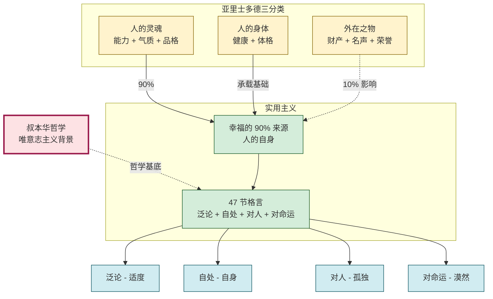

# 概念图谱

> 《人生的智慧》的整体结构图。中央是"亚里士多德三分类"（外在 / 灵魂 / 身体），上方是叔本华的唯意志论背景，下方是幸福的流向。

```mermaid
graph TB
    SP[叔本华哲学<br/>唯意志主义背景]

    subgraph 亚里士多德三分类
        EX[外在之物<br/>财产 + 名声 + 荣誉]
        SO[人的灵魂<br/>能力 + 气质 + 品格]
        BO[人的身体<br/>健康 + 体格]
    end

    subgraph 实用主义
        HS["幸福的 90% 来源<br/>人的自身"]
        GR[47 节格言<br/>泛论 + 自处 + 对人 + 对命运]
    end

    SO -->|90%| HS
    BO -->|承载基础| HS
    EX -.->|10% 影响| HS

    SP -.->|哲学基底| GR
    HS --> GR

    GR --> SUB1["泛论 - 适度"]
    GR --> SUB2["自处 - 自身"]
    GR --> SUB3["对人 - 孤独"]
    GR --> SUB4["对命运 - 漠然"]

    classDef core fill:#fde2e4,stroke:#9b1c4d,stroke-width:3px
    classDef side fill:#fff3cd,stroke:#856404
    classDef grade fill:#d4edda,stroke:#155724
    classDef sub fill:#d1ecf1,stroke:#0c5460

    class SP core
    class EX,SO,BO side
    class HS,GR grade
    class SUB1,SUB2,SUB3,SUB4 sub
```
