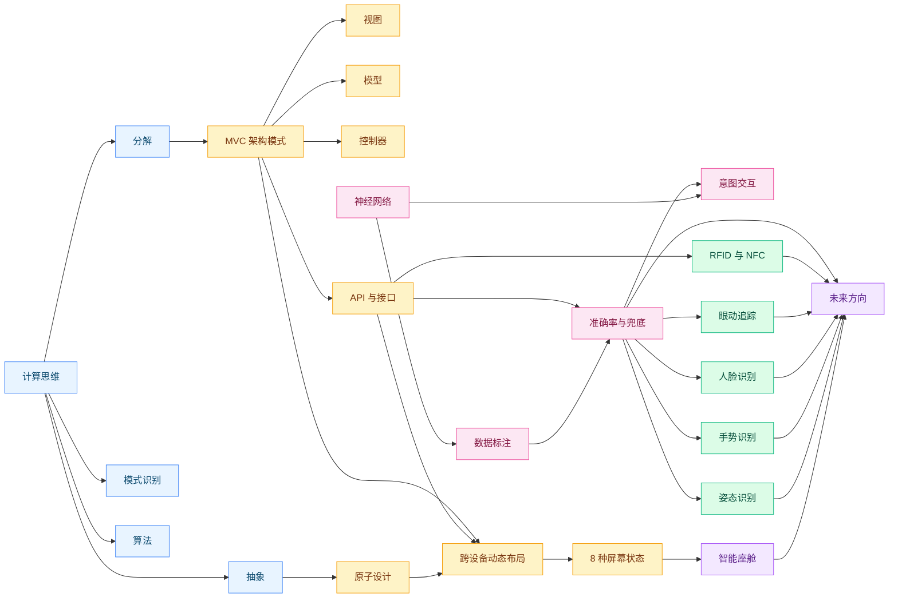

# 概念图谱

> 本书核心概念的关系图。从思维工具 → 架构骨架 → 跨设备 → AI → 感知 → 未来方向,展示概念之间的依赖与并列关系。

## 图表说明

- **思维工具**(蓝色):计算思维四要素——是后续所有概念的「语法」
- **架构骨架**(黄色):MVC + 原子设计 + API + 动态布局——把思维工具落到应用层
- **AI 框架**(粉色):神经网络 + 数据标注 + 准确率与兜底 + 意图交互——AI 时代的核心方法论
- **传感器层**(绿色):姿态 / 手势 / 人脸 / 眼动 / 设备互联——非 GUI 输入的具体实现
- **未来方向**(紫色):智能座舱 + 未来方向——把多个领域汇聚到「技术未成熟」的清单

## 关联

- [[读书脑图]]
- [[主题-技术架构思维赋能设计]]
- [[主题-传感器与AI驱动的体验设计]]
- [[主题-未来设计的不确定性]]