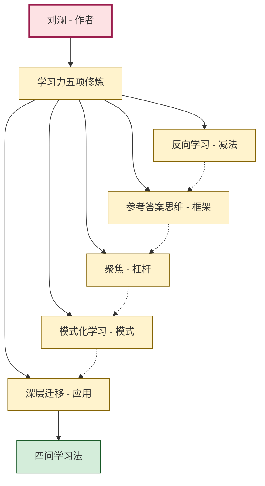

```mermaid
graph TB
    LL[刘澜 - 作者]
    LS[学习力五项修炼]

    RA[反向学习 - 减法]
    RE[参考答案思维 - 框架]
    FO[聚焦 - 杠杆]
    PA[模式化学习 - 模式]
    DM[深层迁移 - 应用]

    Q4[四问学习法]

    LL --> LS
    LS --> RA
    LS --> RE
    LS --> FO
    LS --> PA
    LS --> DM
    DM --> Q4

    RA -.-> RE
    RE -.-> FO
    FO -.-> PA
    PA -.-> DM

    classDef author fill:#fde2e4,stroke:#9b1c4d,stroke-width:3px
    classDef cap fill:#fff3cd,stroke:#856404
    classDef tool fill:#d4edda,stroke:#155724

    class LL author
    class LS cap
    class RA,RE,FO,PA,DM cap
    class Q4 tool
```
