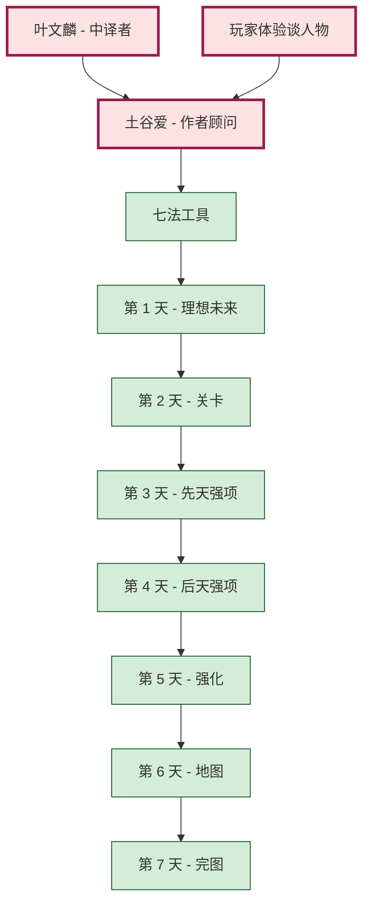

```mermaid
graph TB
    DA[土谷爱 - 作者顾问]
    YL[叶文麟 - 中译者]
    DK[玩家体验谈人物]

    QF[七法工具]
    Q1[第 1 天 - 理想未来]
    Q2[第 2 天 - 关卡]
    Q3[第 3 天 - 先天强项]
    Q4[第 4 天 - 后天强项]
    Q5[第 5 天 - 强化]
    Q6[第 6 天 - 地图]
    Q7[第 7 天 - 完图]

    DA --> QF
    YL --> DA
    DK --> DA

    QF --> Q1
    Q1 --> Q2
    Q2 --> Q3
    Q3 --> Q4
    Q4 --> Q5
    Q5 --> Q6
    Q6 --> Q7

    classDef person fill:#fde2e4,stroke:#9b1c4d,stroke-width:3px
    classDef day fill:#d4edda,stroke:#155724

    class DA,YL,DK person
    class Q1,Q2,Q3,Q4,Q5,Q6,Q7 day
    class QF day
```
