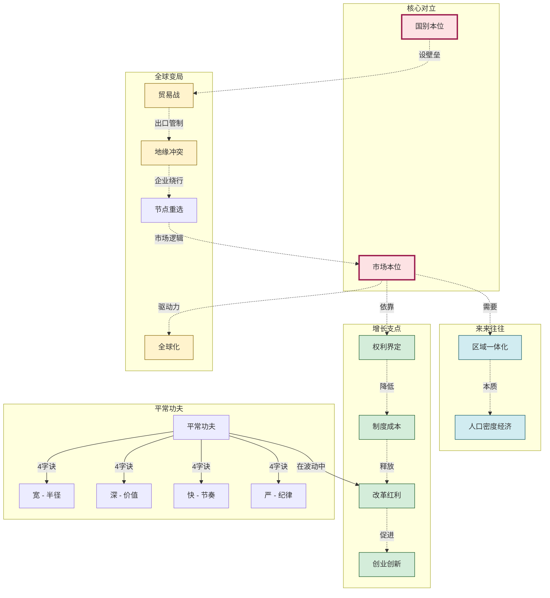

# 概念图谱

> 《寻路集》核心概念的关系图。中央是"市场本位 vs 国别本位"的对立，外周是制度成本 / 改革开放 / 平常功夫等。

```mermaid
graph TB
    subgraph 核心对立
        MB[市场本位]
        GB[国别本位]
    end

    subgraph 全球变局
        GL[全球化]
        TW[贸易战]
        PN[节点重选]
        GC[地缘冲突]
    end

    subgraph 增长支点
        RE[改革红利]
        RC[制度成本]
        RW[权利界定]
        EF[创业创新]
    end

    subgraph 来来往往
        RI[区域一体化]
        PD[人口密度经济]
    end

    subgraph 平常功夫
        PK[平常功夫]
        K1[宽 - 半径]
        K2[深 - 价值]
        K3[快 - 节奏]
        K4[严 - 纪律]
    end

    GB -.->|设壁垒| TW
    TW -.->|出口管制| GC
    GC -.->|企业绕行| PN
    PN -.->|市场逻辑| MB
    MB -.->|驱动力| GL

    MB -.->|依靠| RW
    RW -.->|降低| RC
    RC -.->|释放| RE
    RE -.->|促进| EF

    MB -.->|需要| RI
    RI -.->|本质| PD

    PK -->|4字诀| K1
    PK -->|4字诀| K2
    PK -->|4字诀| K3
    PK -->|4字诀| K4
    PK -->|在波动中| RE

    classDef core fill:#fde2e4,stroke:#9b1c4d,stroke-width:3px
    classDef theme fill:#fff3cd,stroke:#856404
    classDef growth fill:#d4edda,stroke:#155724
    classDef trade fill:#d1ecf1,stroke:#0c5460

    class MB,GB core
    class GL,TW,GC theme
    class RE,RC,RW,EF growth
    class RI,PD trade
```
