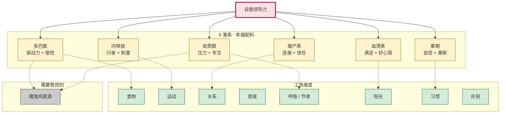

# 概念图谱

> 《情绪鸡尾酒》6 激素框架的整体结构图。中央是"自我领导力"，6 大激素围在四周，每个激素给出"过多 / 过少"两端反应。负面循环作为反向通路。

```mermaid
graph TB
    SL[自我领导力]

    subgraph 6 激素 - 幸福配料
        DA[多巴胺<br/>驱动力 + 愉悦]
        OT[催产素<br/>连接 + 信任]
        ST[血清素<br/>满足 + 好心情]
        CR[皮质醇<br/>压力 + 专注]
        EN[内啡肽<br/>兴奋 + 刺激]
        TS[睾酮<br/>自信 + 果断]
    end

    subgraph 工具维度
        FD[食物]
        MO[运动]
        RE[关系]
        TH[思维]
        SP[呼吸 / 节律]
        SLG[阳光]
        HA[习惯]
        CB[庆祝]
    end

    subgraph 需要管控的
        DC[魔鬼鸡尾酒]
    end

    SL --> DA
    SL --> OT
    SL --> ST
    SL --> CR
    SL --> EN
    SL --> TS

    DA -.-> FD
    OT -.-> RE
    ST -.-> SLG
    CR -.-> SP
    EN -.-> MO
    TS -.-> HA

    CR -.-> DC
    DA -.-> DC

    classDef central fill:#fde2e4,stroke:#9b1c4d,stroke-width:3px
    classDef hormone fill:#fff3cd,stroke:#856404
    classDef tool fill:#d4edda,stroke:#155724
    classDef dark fill:#cccccc,stroke:#333333

    class SL central
    class DA,OT,ST,CR,EN,TS hormone
    class FD,MO,RE,TH,SP,SLG,HA,CB tool
    class DC dark
```
