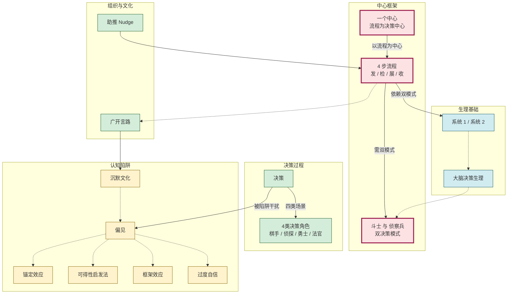

# 概念图谱

> 决策科学的整体结构图。中央是**一个中心** + **4 步流程**，外周是各概念与决策陷阱的关系。

```mermaid
graph TB
    subgraph 中心框架
        OC[一个中心<br/>流程为决策中心]
        F4[4 步流程<br/>发 / 检 / 展 / 收]
        FS[斗士 与 侦察兵<br/>双决策模式]
    end

    subgraph 决策过程
        DM[决策]
        NC[4类决策角色<br/>棋手 / 侦探 / 勇士 / 法官]
    end

    subgraph 认知陷阱
        P[偏见]
        AN[锚定效应]
        AV[可得性启发法]
        FR[框架效应]
        OC2[过度自信]
        CG[沉默文化]
    end

    subgraph 组织与文化
        SK[广开言路]
        ND[助推 Nudge]
    end

    subgraph 生理基础
        BR[大脑决策生理]
        S1[系统 1 / 系统 2]
    end

    OC -->|以流程为中心| F4
    F4 -->|需双模式| FS
    F4 -->|依赖双模式| S1

    DM -->|四类场景| NC
    DM -->|被陷阱干扰| P

    P -.-> AN
    P -.-> AV
    P -.-> FR
    P -.-> OC2
    CG -.-> P

    F4 -.-> SK
    SK --> CG
    ND --> F4

    S1 -.-> BR
    BR -.-> FS

    classDef center fill:#fde2e4,stroke:#9b1c4d,stroke-width:3px
    classDef trap fill:#fff3cd,stroke:#856404
    classDef org fill:#d4edda,stroke:#155724
    classDef bio fill:#d1ecf1,stroke:#0c5460

    class OC,F4,FS center
    class P,AN,AV,FR,OC2,CG trap
    class SK,ND,DM,NC org
    class BR,S1 bio
```
