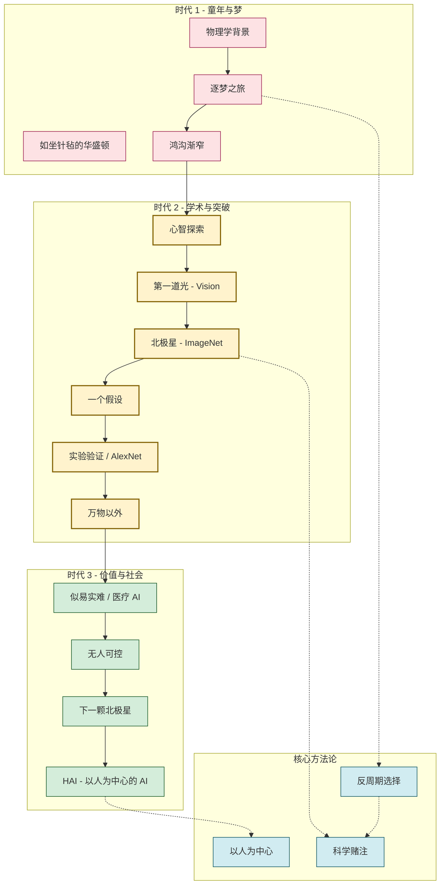

# 概念图谱

> 李飞飞自传 / AI 史 的整体结构图。中央是"3 大时代"——童年/学术/伦理，外周是核心概念。

```mermaid
graph TB
    subgraph 时代 1 - 童年与梦
        DC["如坐针毡的华盛顿"]
        SC["逐梦之旅"]
        NG["鸿沟渐窄"]
        PH["物理学背景"]
    end

    subgraph 时代 2 - 学术与突破
        DM["心智探索"]
        FL["第一道光 - Vision"]
        NS["北极星 - ImageNet"]
        HP["一个假设"]
        EX["实验验证 / AlexNet"]
        WB["万物以外"]
    end

    subgraph 时代 3 - 价值与社会
        DS["似易实难 / 医疗 AI"]
        NC["无人可控"]
        PT["下一颗北极星"]
        HAI["HAI - 以人为中心的 AI"]
    end

    subgraph 核心方法论
        SC2["反周期选择"]
        SB["科学赌注"]
        SB2["以人为中心"]
    end

    PH --> SC
    SC --> NG
    NG --> DM
    DM --> FL
    FL --> NS
    NS --> HP
    HP --> EX
    EX --> WB
    WB --> DS
    DS --> NC
    NC --> PT
    PT --> HAI

    SC -.-> SC2
    NS -.-> SB
    SC2 -.-> SB
    HAI -.-> SB2

    classDef phase1 fill:#fde2e4,stroke:#9b1c4d
    classDef phase2 fill:#fff3cd,stroke:#856404,stroke-width:2px
    classDef phase3 fill:#d4edda,stroke:#155724
    classDef eth fill:#d1ecf1,stroke:#0c5460

    class DC,SC,NG,PH phase1
    class DM,FL,NS,HP,EX,WB phase2
    class DS,NC,PT,HAI phase3
    class SC2,SB,SB2 eth
```
