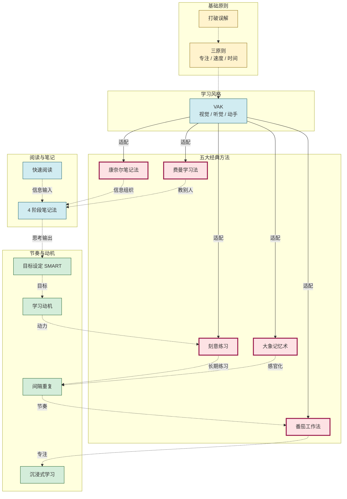

# 概念图谱

> 学习系统的整体结构图。中央是 **5 大经典方法**，外周是基础原则、学习风格、动机。

```mermaid
graph TB
    subgraph 五大经典方法
        CN["康奈尔笔记法"]
        FN["费曼学习法"]
        DL["刻意练习"]
        PT["番茄工作法"]
        MM["大象记忆术"]
    end

    subgraph 基础原则
        BS["打破误解"]
        PR["三原则<br/>专注 / 速度 / 时间"]
    end

    subgraph 学习风格
        VAK["VAK<br/>视觉 / 听觉 / 动手"]
    end

    subgraph 节奏与动机
        SP[间隔重复]
        ST[沉浸式学习]
        GO[目标设定 SMART]
        MO[学习动机]
    end

    subgraph 阅读与笔记
        SR[快速阅读]
        N4[4 阶段笔记法]
    end

    BS -.-> PR
    PR -.-> VAK
    VAK -->|适配| CN
    VAK -->|适配| FN
    VAK -->|适配| DL
    VAK -->|适配| PT
    VAK -->|适配| MM

    CN -.->|信息组织| N4
    FN -.->|教别人| N4
    SR -.->|信息输入| N4
    N4 -.->|思考输出| GO

    DL -.->|长期练习| SP
    MM -.->|感官化| SP
    SP -.->|节奏| PT
    PT -.->|专注| ST

    GO -.->|目标| MO
    MO -.->|动力| DL

    classDef method fill:#fde2e4,stroke:#9b1c4d,stroke-width:3px
    classDef base fill:#fff3cd,stroke:#856404
    classDef rhythm fill:#d4edda,stroke:#155724
    classDef misc fill:#d1ecf1,stroke:#0c5460

    class CN,FN,DL,PT,MM method
    class BS,PR base
    class SP,ST,GO,MO rhythm
    class VAK,SR,N4 misc
```
