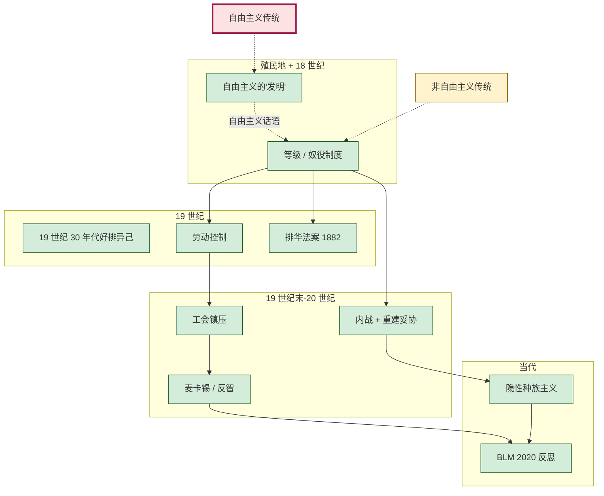

# 概念图谱

> 《自由之困》250 年主线结构图。中央是"自由 / 非自由"的对抗轴。

```mermaid
graph TB
    LB[自由主义传统]
    IL[非自由主义传统]

    subgraph 殖民地 + 18 世纪
        C1[等级 / 奴役制度]
        C2[自由主义的'发明']
    end

    subgraph 19 世纪
        C3[19 世纪 30 年代好排异己]
        C4[劳动控制]
        C5[排华法案 1882]
    end

    subgraph 19 世纪末-20 世纪
        C6[内战 + 重建妥协]
        C7[工会镇压]
        C8[麦卡锡 / 反智]
    end

    subgraph 当代
        C9[隐性种族主义]
        C10[BLM 2020 反思]
    end

    LB -.-> C2
    C2 -.->|自由主义话语| C1
    IL -.-> C1
    C1 --> C4
    C1 --> C5
    C1 --> C6
    C4 --> C7
    C6 --> C9
    C7 --> C8
    C8 --> C10
    C9 --> C10

    classDef pos fill:#fde2e4,stroke:#9b1c4d,stroke-width:3px
    classDef neg fill:#fff3cd,stroke:#856404
    classDef sub fill:#d4edda,stroke:#155724

    class LB pos
    class IL neg
    class C1,C2,C3,C4,C5,C6,C7,C8,C9,C10 sub
```
