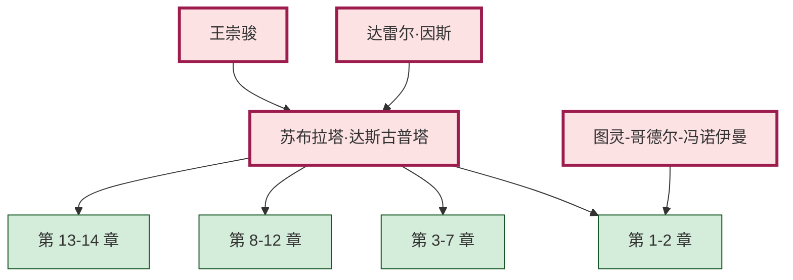

```mermaid
graph TB
    DG[苏布拉塔·达斯古普塔]
    DI[达雷尔·因斯]
    WCJ[王崇骏]
    TGN[图灵-哥德尔-冯诺伊曼]

    C1[第 1-2 章]
    C2[第 3-7 章]
    C3[第 8-12 章]
    C4[第 13-14 章]

    DG --> C1
    DG --> C2
    DG --> C3
    DG --> C4
    DI --> DG
    WCJ --> DG
    TGN --> C1

    classDef person fill:#fde2e4,stroke:#9b1c4d,stroke-width:3px
    classDef chap fill:#d4edda,stroke:#155724

    class DG,DI,WCJ,TGN person
    class C1,C2,C3,C4 chap
```
