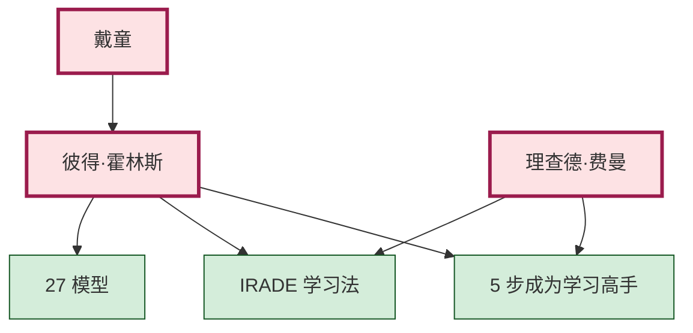

```mermaid
graph TB
    PH[彼得·霍林斯]
    RF[理查德·费曼]
    DT[戴童]

    S5[5 步成为学习高手]
    IR[IRADE 学习法]
    FM[27 模型]

    PH --> S5
    PH --> IR
    PH --> FM
    RF --> S5
    RF --> IR
    DT --> PH

    classDef person fill:#fde2e4,stroke:#9b1c4d,stroke-width:3px
    classDef method fill:#d4edda,stroke:#155724

    class PH,RF,DT person
    class S5,IR,FM method
```
