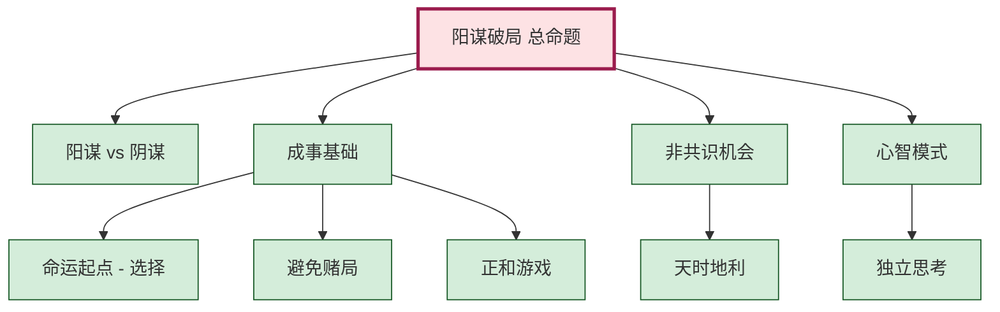

# 概念图谱

```mermaid
graph TB
    BK[阳谋破局 总命题]
    DY[阳谋 vs 阴谋]
    SS[成事基础]
    FJ[非共识机会]
    XP[心智模式]

    SUB1[命运起点 - 选择]
    SUB2[避免赌局]
    SUB3[正和游戏]
    SUB4[独立思考]
    SUB5[天时地利]

    BK --> DY
    BK --> SS
    BK --> FJ
    BK --> XP

    SS --> SUB1
    SS --> SUB2
    SS --> SUB3
    XP --> SUB4
    FJ --> SUB5

    classDef core fill:#fde2e4,stroke:#9b1c4d,stroke-width:3px
    classDef sub fill:#d4edda,stroke:#155724

    class BK core
    class DY,SS,FJ,XP sub
    class SUB1,SUB2,SUB3,SUB4,SUB5 sub
```
