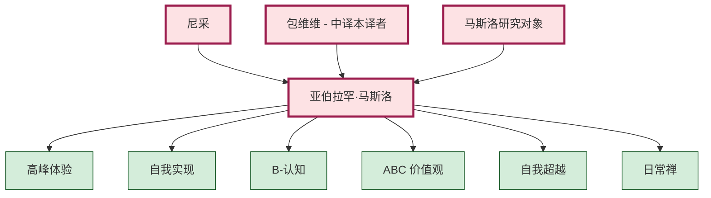

```mermaid
graph TB
    AM[亚伯拉罕·马斯洛]
    NIT[尼采]
    BWV[包维维 - 中译本译者]
    MR[马斯洛研究对象]

    PE[高峰体验]
    SI[自我实现]
    BC[B-认知]
    BV[ABC 价值观]
    ST[自我超越]
    DZ[日常禅]

    AM --> PE
    AM --> SI
    AM --> BC
    AM --> BV
    AM --> ST
    AM --> DZ
    NIT --> AM
    BWV --> AM
    MR --> AM

    classDef person fill:#fde2e4,stroke:#9b1c4d,stroke-width:3px
    classDef concept fill:#d4edda,stroke:#155724

    class AM,NIT,BWV,MR person
    class PE,SI,BC,BV,ST,DZ concept
```
